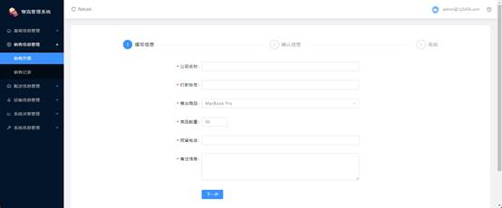
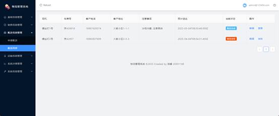
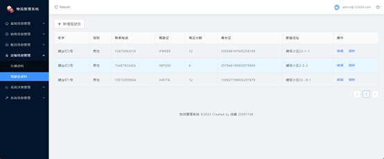
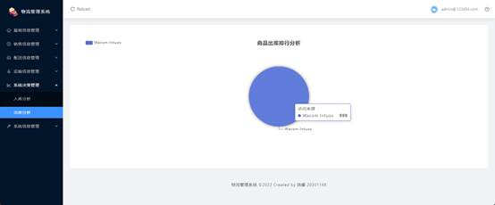
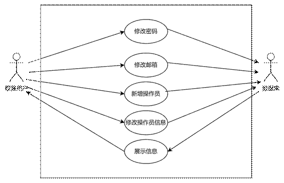

**Java EE 架构与应用 Assignment 1 物流管理系统  系统设计报告** 

项目地址链接：[divergent020620/JavaEEProjectServer at Assignment_1 (github.com)](https://github.com/divergent020620/JavaEEProjectServer/tree/Assignment_1)

| 成员 | 组长     | 组员1    | 组员2    |
| ---- | -------- | -------- | -------- |
| 学号 | 20301182 | 20301168 | 20301174 |
| 姓名 | 袁毅堂   | 饶睿     | 万兴全   |

# 要求

Assignment 1, A **Shipping and Transportation Web application** Development with Spring MVC and More
	In this assignment, you are asked to develop functions for a shipping and transportation web application.

**_Requirements:_**
1, Using Spring MVC/**Spring boot** + **Spring Data JPA**/Mybatis + **Thymeleaf** for Web Application Development.
2, **Authentication** and **authorization for web access** is necessary.
3, Unit **testing for repository level** and **integration testing controllers** are required.
4, You are encouraged to apply **spring security**, cookies, session management, interceptors /filters to improve the system functions.

# 系统总体设计

本次项目为物流管理系统，主要分为6大模块15个工作包。系统设计图如下：

（1）基础信息管理模块

主要包括商品管理，设置商品的信息；来往单位，查看单位信息；员工管理，编辑修改员工信息；仓库管理，编辑修改仓库信息和管理人信息，包括商品的出库入库；

（2）销售信息管理

包括销售开票，在这里可以确认企业账款到账，编辑后自动同步到单位信息中；销售记录，查看企业的销售转账记录。

（3）配送信息管理

主要包括申请配送，须选择在系统内的商品和系统内车辆和驾驶员，同时可以选择配送时间和配送类型。在申请完后会出现在配送列表内，管理员之后可以进行审核通过来完成配送。

（4）运输信息管理

主要对车辆信息和驾驶员信息进行编辑增加和删除。

（5）系统决策管理

通过对仓库管理的信息来进行入库商品分析和出库商品分析。

（6）系统信息管理

系统管理员可以在此模块编辑各用户的管理权限，同时可以在此版块可以通过安全设置设置自己的邮箱和密码，同时查看自己的权限通过权限列表。

## 数据库设计

根据架构设计，我们设计生成了13张表，ER图如下：

**表说明**

| **序号** | **表名**         | **注释/说明** |
| -------- | ---------------- | ------------- |
| 1        | admin            | 管理员信息    |
| 2        | code             | 验证码        |
| 3        | commodity        | 货物信息      |
| 4        | company          | 公司信息      |
| 5        | distribution     | 配送信息      |
| 6        | driver           | 驾驶员信息    |
| 7        | employee         | 员工信息      |
| 8        | inventory        | 账单信息      |
| 9        | inventory_record | 账单记录信息  |
| 10       | sale             | 销售信息      |
| 11       | user             | 用户信息      |
| 12       | vehicle          | 车辆信息      |
| 13       | warehouse        | 仓库信息      |

**数据库表结构**

**1**、admin

| **序号** | **列名**  | **数据类型** | **长度** | **小数位** | **主键** | **自增** | **允许空** | **默认值** | **列说明** |
| -------- | --------- | ------------ | -------- | ---------- | -------- | -------- | ---------- | ---------- | ---------- |
| 1        | id        | varchar      | 255      |            | √        |          |            |            |            |
| 2        | create_at | varchar      | 255      |            |          |          | √          |            |            |
| 3        | email     | varchar      | 255      |            |          |          | √          |            |            |
| 4        | password  | varchar      | 255      |            |          |          | √          |            |            |
| 5        | roles     | varchar      | 255      |            |          |          | √          |            |            |

**2**、code

| **序号** | **列名** | **数据类型** | **长度** | **小数位** | **主键** | **自增** | **允许空** | **默认值** | **列说明** |
| -------- | -------- | ------------ | -------- | ---------- | -------- | -------- | ---------- | ---------- | ---------- |
| 1        | email    | varchar      | 255      |            | √        |          |            |            |            |
| 2        | exp      | bigint       |          |            |          |          |            |            |            |
| 3        | value    | varchar      | 255      |            |          |          | √          |            |            |

**3**、commodity

| **序号** | **列名**    | **数据类型** | **长度** | **小数位** | **主键** | **自增** | **允许空** | **默认值** | **列说明** |
| -------- | ----------- | ------------ | -------- | ---------- | -------- | -------- | ---------- | ---------- | ---------- |
| 1        | id          | varchar      | 255      |            | √        |          |            |            |            |
| 2        | count       | int          |          |            |          |          |            |            |            |
| 3        | create_at   | varchar      | 255      |            |          |          | √          |            |            |
| 4        | description | varchar      | 255      |            |          |          | √          |            |            |
| 5        | name        | varchar      | 255      |            |          |          | √          |            |            |
| 6        | price       | double       | 22       |            |          |          |            |            |            |
| 7        | update_at   | varchar      | 255      |            |          |          | √          |            |            |

**4**、company

| **序号** | **列名** | **数据类型** | **长度** | **小数位** | **主键** | **自增** | **允许空** | **默认值** | **列说明** |
| -------- | -------- | ------------ | -------- | ---------- | -------- | -------- | ---------- | ---------- | ---------- |
| 1        | id       | varchar      | 255      |            | √        |          |            |            |            |

**5**、distribution

| **序号** | **列名** | **数据类型** | **长度** | **小数位** | **主键** | **自增** | **允许空** | **默认值** | **列说明** |
| -------- | -------- | ------------ | -------- | ---------- | -------- | -------- | ---------- | ---------- | ---------- |
| 1        | id       | varchar      | 255      |            | √        |          |            |            |            |
| 2        | address  | varchar      | 255      |            |          |          | √          |            |            |
| 3        | care     | varchar      | 255      |            |          |          | √          |            |            |
| 4        | did      | varchar      | 255      |            |          |          | √          |            |            |
| 5        | driver   | varchar      | 255      |            |          |          | √          |            |            |
| 6        | number   | varchar      | 255      |            |          |          | √          |            |            |
| 7        | phone    | varchar      | 255      |            |          |          | √          |            |            |
| 8        | status   | int          |          |            |          |          | √          |            |            |
| 9        | time     | varchar      | 255      |            |          |          | √          |            |            |
| 10       | urgent   | bit          |          |            |          |          |            |            |            |
| 11       | vid      | varchar      | 255      |            |          |          | √          |            |            |

**6**、driver

| **序号** | **列名**  | **数据类型** | **长度** | **小数位** | **主键** | **自增** | **允许空** | **默认值** | **列说明** |
| -------- | --------- | ------------ | -------- | ---------- | -------- | -------- | ---------- | ---------- | ---------- |
| 1        | id        | varchar      | 255      |            | √        |          |            |            |            |
| 2        | address   | varchar      | 255      |            |          |          | √          |            |            |
| 3        | create_at | varchar      | 255      |            |          |          | √          |            |            |
| 4        | driving   | bit          |          |            |          |          |            |            |            |
| 5        | gender    | varchar      | 255      |            |          |          | √          |            |            |
| 6        | id_card   | varchar      | 255      |            |          |          | √          |            |            |
| 7        | license   | varchar      | 255      |            |          |          | √          |            |            |
| 8        | name      | varchar      | 255      |            |          |          | √          |            |            |
| 9        | phone     | varchar      | 255      |            |          |          | √          |            |            |
| 10       | score     | varchar      | 255      |            |          |          | √          |            |            |
| 11       | update_at | varchar      | 255      |            |          |          | √          |            |            |

**7**、employee

| **序号** | **列名**   | **数据类型** | **长度** | **小数位** | **主键** | **自增** | **允许空** | **默认值** | **列说明** |
| -------- | ---------- | ------------ | -------- | ---------- | -------- | -------- | ---------- | ---------- | ---------- |
| 1        | id         | varchar      | 255      |            | √        |          |            |            |            |
| 2        | address    | varchar      | 255      |            |          |          | √          |            |            |
| 3        | create_at  | varchar      | 255      |            |          |          | √          |            |            |
| 4        | department | varchar      | 255      |            |          |          | √          |            |            |
| 5        | gender     | varchar      | 255      |            |          |          | √          |            |            |
| 6        | id_card    | varchar      | 255      |            |          |          | √          |            |            |
| 7        | name       | varchar      | 255      |            |          |          | √          |            |            |
| 8        | phone      | varchar      | 255      |            |          |          | √          |            |            |
| 9        | update_at  | varchar      | 255      |            |          |          | √          |            |            |

**8**、inventory

| **序号** | **列名** | **数据类型** | **长度** | **小数位** | **主键** | **自增** | **允许空** | **默认值** | **列说明** |
| -------- | -------- | ------------ | -------- | ---------- | -------- | -------- | ---------- | ---------- | ---------- |
| 1        | id       | varchar      | 255      |            | √        |          |            |            |            |
| 2        | cid      | varchar      | 255      |            |          |          | √          |            |            |
| 3        | count    | int          |          |            |          |          | √          |            |            |
| 4        | location | varchar      | 255      |            |          |          | √          |            |            |
| 5        | name     | varchar      | 255      |            |          |          | √          |            |            |
| 6        | wid      | varchar      | 255      |            |          |          | √          |            |            |

**9**、inventory_record

| **序号** | **列名**    | **数据类型** | **长度** | **小数位** | **主键** | **自增** | **允许空** | **默认值** | **列说明** |
| -------- | ----------- | ------------ | -------- | ---------- | -------- | -------- | ---------- | ---------- | ---------- |
| 1        | id          | varchar      | 255      |            | √        |          |            |            |            |
| 2        | cid         | varchar      | 255      |            |          |          | √          |            |            |
| 3        | count       | int          |          |            |          |          | √          |            |            |
| 4        | create_at   | varchar      | 255      |            |          |          | √          |            |            |
| 5        | description | varchar      | 255      |            |          |          | √          |            |            |
| 6        | name        | varchar      | 255      |            |          |          | √          |            |            |
| 7        | type        | int          |          |            |          |          | √          |            |            |
| 8        | wid         | varchar      | 255      |            |          |          | √          |            |            |

**10**、sale

| **序号** | **列名**    | **数据类型** | **长度** | **小数位** | **主键** | **自增** | **允许空** | **默认值** | **列说明** |
| -------- | ----------- | ------------ | -------- | ---------- | -------- | -------- | ---------- | ---------- | ---------- |
| 1        | id          | varchar      | 255      |            | √        |          |            |            |            |
| 2        | commodity   | varchar      | 255      |            |          |          | √          |            |            |
| 3        | company     | varchar      | 255      |            |          |          | √          |            |            |
| 4        | count       | varchar      | 255      |            |          |          | √          |            |            |
| 5        | create_at   | varchar      | 255      |            |          |          | √          |            |            |
| 6        | description | varchar      | 255      |            |          |          | √          |            |            |
| 7        | number      | varchar      | 255      |            |          |          | √          |            |            |
| 8        | pay         | bit          |          |            |          |          |            |            |            |
| 9        | phone       | varchar      | 255      |            |          |          | √          |            |            |
| 10       | price       | double       | 22       |            |          |          |            |            |            |

**11**、user

| **序号** | **列名**  | **数据类型** | **长度** | **小数位** | **主键** | **自增** | **允许空** | **默认值** | **列说明** |
| -------- | --------- | ------------ | -------- | ---------- | -------- | -------- | ---------- | ---------- | ---------- |
| 1        | id        | varchar      | 255      |            | √        |          |            |            |            |
| 2        | create_at | varchar      | 255      |            |          |          | √          |            |            |
| 3        | password  | varchar      | 255      |            |          |          | √          |            |            |
| 4        | update_at | varchar      | 255      |            |          |          | √          |            |            |
| 5        | username  | varchar      | 255      |            |          |          | √          |            |            |

**12**、vehicle

| **序号** | **列名**  | **数据类型** | **长度** | **小数位** | **主键** | **自增** | **允许空** | **默认值** | **列说明** |
| -------- | --------- | ------------ | -------- | ---------- | -------- | -------- | ---------- | ---------- | ---------- |
| 1        | id        | varchar      | 255      |            | √        |          |            |            |            |
| 2        | create_at | varchar      | 255      |            |          |          | √          |            |            |
| 3        | driving   | bit          |          |            |          |          |            |            |            |
| 4        | number    | varchar      | 255      |            |          |          | √          |            |            |
| 5        | type      | varchar      | 255      |            |          |          | √          |            |            |

**13**、warehouse 

| **序号** | **列名**  | **数据类型** | **长度** | **小数位** | **主键** | **自增** | **允许空** | **默认值** | **列说明** |
| -------- | --------- | ------------ | -------- | ---------- | -------- | -------- | ---------- | ---------- | ---------- |
| 1        | id        | varchar      | 255      |            | √        |          |            |            |            |
| 2        | create_at | varchar      | 255      |            |          |          | √          |            |            |
| 3        | name      | varchar      | 255      |            |          |          | √          |            |            |
| 4        | principle | varchar      | 255      |            |          |          | √          |            |            |

# 系统详细设计

模块设计

\1. 登陆模块

系统在初次启动时会显示为初始化系统，填入的邮箱密码为后续具有超级管理员权限的账号。以后登陆时变为正常的登陆界面。

由于系统封闭管理，注册统一由超级管理员或操作员管理员进行操作，仅提供登录功能。登陆可选邮箱密码登陆以及邮箱验证码登陆。用户可勾选自动登录以便下次登录时跳过这一模块业务。用户可点击忘记密码通过邮箱找回密码。

 

\2. 基础信息管理模块

用例图

 

组件设计

（1） 商品管理

此组件展示所有商品及其信息，分别为商品名称、库存数量、描述信息、入库时间与商品单价。用户可在顶部搜索列表中已有商品并展示以及用重置取消搜索展示的内容。权限用户可新增商品，输入商品名称、商品单价以及描述信息确定后会自动填充入库时间，库存数量默认为空，在另外组件中修改，此组件对库存仅做展示。

 

（2） 来往单位

此组件展示在销售开票组件中有来往的单位。展示内容为公司名称、预留电话以及首次创建时的时间。页面中可在顶部搜索来往公司并展示。

 

（3） 员工管理

此组件展示所有员工及其信息，分别为名字、性别、所在部门、联系电话、身份证以及家庭住址。权限用户可在顶部选择新增员工，对于身份证号与联系方式具有合法性验证，所在仓库为仓库管理组件中创建的仓库，性别为避免错误输入使用单选框选择。权限用户可编辑已有员工信息或删除已有员工信息。

 

（4） 仓库管理

此组件首先以卡片的形式展示所有仓库，权限用户可在首个卡片的位置可以选择添加仓库，添加时需输入仓库名称与仓库负责人，系统会给予ID作为唯一标识。代表每个仓库的卡片上可以选择库存管理进入仓库的次级页面。次级页面左上角可以选择返回上一页，其下展示仓库库存，展示项目为商品ID、商品名以及库存数量，此处各信息与商品管理组件中的信息相对应，商品管理组件中会集中展示所有仓库中各个商品的信息。权限用户可选择出入库商品，为避免输入错误选择商品使用下拉框的形式，商品数量具有合法性校验（单次不超过9999以及库存数量并且必须为正整数）。权限用户可通过按键下载excel格式的库存报表。权限用户可查看出入库记录，并可进一步选择下载excel格式的出入库记录。

 

\3. 销售信息管理模块

用例图

 

组件设计

（1） 销售开票

权限用户需按照填写信息、确认信息以及完成三个步骤完成本组件的业务，在顶部有当前处于何步骤的指示。填写信息中需分别输入公司名称、打款账号、售出商品、商品数量、预留电话以及备注信息，其中售出商品为避免输入错误使用下拉框选择，内容为商品管理组件中展示的商品。商品数量与预留电话具有相应合法性校验，除备注之外不能为空值。

确认信息中会展示上一步输入的信息，并且在右下角需展示商品的总价值，用户需要选择提交或返回上一部进行更改，提交按钮需要醒目，考虑使用红色按钮。确认后进入完成页面，提示提交完成并由用户选择重新提交新一份销售开票或是前往销售记录组件。

 

（2） 销售记录

此组件展示销售开票组件中完成业务的记录，展示内容分别为公司名称、打款账号、商品、数量、总计金额、预留电话、备注、开票时间以及更多操作。此页面对除更多操作以外的信息仅可作展示而不可修改。销售开票组件业务完成的一条记录的更多操作初始默认设置为等待结款，用户可点击结款并在弹出的确认窗口中确认后，方可置为借款完成。

 

\4. 配送信息管理模块

用例图

 

组件设计

（1） 申请配送

权限用户需按照填写申请信息、确认配送信息以及完成申请三个步骤完成本组件的业务，在顶部有当前处于何步骤的指示。填写配送信息中需分别输入选择司机、选择运输车辆、预计交货时间、是否加急处理、注意事项、客户电话以及客户地址。为避免输入出现错误，只有客户电话与客户地址由人工输入，客户电话具有合法性验证。司机、运输车辆以及交货时间由下拉框选择，前两者分别从运输信息管理的车辆资料组件以及驾驶员资料组件中的信息中选择，已经处于配送业务中的司机或车辆应有标识并且选中时不可前往下一步。加急处理设为开关样式按钮，注意事项由复选框选择是否冰柜冷藏、注意易碎以及防止高温。

确认信息中会展示上一步输入的信息，用户需要选择提交或返回上一部进行更改，提交按钮需要醒目，考虑使用红色按钮。确认后进入完成页面，提示提交完成并由用户选择重新提交新一份配送申请或是前往配送列表组件。

 

（2） 配送列表

此组件展示已完成申请业务的配送的记录，展示内容分别为司机、车牌号、客户电话、客户地址、注意事项、预计送达、当前状态以及操作。此页面对除操作以外的信息仅可作展示而不可修改。申请配送组件业务完成的一条记录的操作初始默认设置为等待审核。权限用户可点击编辑改变之前的信息，确认信息无误后可选择审核。审核中会弹出二次确认窗口，二次确认中的确认应足够醒目，使用红色按钮，确认后将当前状态修改为配送完成。

\5. 运输信息管理模块

用例图

 

组件设计

（1） 车辆资料

此组件以卡片的形式展示每一辆车的信息，包括车辆类型、车牌号、ID以及当前状态。权限用户可在第一张卡片的位置可选择添加车辆，需输入车牌号码以及车辆类型，系统会自动分配ID作为唯一标识。在每张卡片上可点击使用记录以查看每辆车的历史配送情况。

 

（2） 驾驶员资料

此组件展示驾驶员信息，包括名字、性别、联系电话、驾驶证号码、驾证分数、身份证以及家庭住址。权限用户可点击新增驾驶员来添加一条驾驶员信息，除性别为选择框以外其他均由用户自行输入，其中身份证号、联系方式以及驾照分数具有合法性校验。权限用户可对每一条信息选择编辑或删除。

 

\6. 系统决策管理模块

用例图

 

组件设计

（1） 入库分析

此组件以饼状图的形式展示所有商品入库数量，不同商品应有不同颜色，并在左上角给出颜色相对应的商品。鼠标悬浮在饼状图代表某商品的区域上时应显示具体的入库数量。

 

（2） 出库分析

此组件以饼状图的形式展示所有商品出库数量，不同商品应有不同颜色，并在左上角给出颜色相对应的商品。鼠标悬浮在饼状图代表某商品的区域上时应显示具体的出库数量。

 

\7. 系统信息管理模块

用例图

 

组件设计

（1） 安全设置

此组件展示当前账号的账号密码以及绑定邮箱，其中密码默认为安全状态显示为“********”，用户点击显示图标后方可进行显示。用户点击相应修改按钮后可对两项数据分别进行修改。

 

（2） 操作员管理

此组件可由权限用户查看与修改操作员。此页面展示操作员的邮箱、密码、权限以及添加日期。权限用户可通过按钮来添加操作员，需输入邮箱密码，均具有合法性校验，密码应由英文字母以及数字组成且大于六个字节，邮箱须符合邮箱格式，提交后系统会自动补全添加日期以及分配ID作为唯一标识。权限默认为空，可在每一条信息最后的action部分修改，权限分为操作员权限、商品全线、销售权限、仓库权限以及员工权限，此权限即各个模块所述需xxx相关权限才可查看与操作的权限，每一位操作员可具有一个或多个权限，系统初始化时的超级管理员具有所有权限。其他信息除ID与添加日期外同样均可在action部分修改。

 

（3） 权限列表

此组件为静态页面，展示五种可设置的权限，其中不包括系统初始化时的超级管理员权限。

 

# 系统的实现与部署

## 前端

（1） Thymeleaf

Thymeleaf是一种Java模板引擎，可以用于在Web和独立环境中处理XML、HTML、JavaScript、CSS甚至纯文本。它采用自然模板语言，能够轻松地将静态模板转换为动态Web文档。Thymeleaf的语法简单易懂，类似于HTML，并且可以与Spring框架完美集成，是开发Spring Web应用的首选模板引擎之一。Thymeleaf支持可插拔的标准方言，能够满足不同项目的需求，同时还提供了一些实用工具，如表单绑定、国际化、条件判断等，使得模板的编写变得更加方便和高效。

 

## 后端

（1） Springboot2

Spring Boot 2是一种基于Spring Framework的开源框架，用于开发企业级Java应用程序。它采用了约定优于配置的原则，旨在简化Spring应用程序的开发和部署，提高开发效率。Spring Boot 2相对于Spring Boot 1.x来说，增加了更多的特性和改进。

以下是Spring Boot 2的一些主要特点和改进：

提供了许多便捷的starter，以便快速引入常见的第三方库和框架，如Spring Data JPA、Spring Security等；

集成了许多常见的开发框架，如Spring MVC、Spring Data、Spring Security等；

引入了Spring Boot Actuator，提供了强大的监控和管理功能，如监控应用程序的健康状态、管理端点等；

内置了Tomcat、Jetty和Undertow等Servlet容器，可快速构建可运行的Jar包；

提供了自动配置和约定大于配置的机制，简化了应用程序的配置；

支持嵌入式的数据库和NoSQL数据存储，如H2、MongoDB等；

提供了全新的WebFlux模块，支持响应式编程，提高应用程序的性能和可伸缩性。

Spring Boot 2是一个功能强大的开源框架，可大大简化企业级Java应用程序的开发和部署，并提供了丰富的特性和改进，是现代化Web应用程序开发的首选框架之一。

 

（2） Spring Data JPA

Spring Data JPA是基于JPA规范的一个持久层框架，提供了许多现成的数据操作接口和默认实现，可以帮助开发者更方便地进行数据访问和持久化。

它可以通过几个简单的注解和接口定义实体类和仓库类，自动生成JPA实现，避免了手写JPA实现的冗余代码和复杂度。同时，Spring Data JPA还提供了基于方法名、查询注解、原生SQL等多种查询方式，支持分页、排序等常用操作，方便了数据操作的编写。

Spring Data JPA还能与Spring Boot等框架无缝集成，提供了自动配置和自动装配的能力，极大地提高了开发效率和可维护性。

 

（3） Lombok

Lombok是一个Java库，可以通过注解方式来简化Java代码的编写，减少冗余的样板代码，从而提高代码的可读性和可维护性。而Spring Boot是一个基于Spring框架的快速开发框架，用于简化Spring应用程序的初始搭建和开发。

Lombok可以与Spring Boot完美集成，通过在实体类上添加注解，Lombok会自动生成Java Bean的Getter、Setter方法、equals()、hashCode()、toString()等方法，从而减少了开发者的代码量，提高了开发效率。在Spring Boot中使用Lombok可以更加简单地进行对象的构建，减少了样板代码的编写，提高了开发效率。

## 数据库

MySQL

MySQL是一种关系型数据库管理系统，是最流行的开源数据库之一。它支持多种操作系统，包括Linux、Windows和MacOS等，并支持多种编程语言，如Java、Python、PHP等。

MySQL的数据存储使用表格，数据以行和列的形式存储在表格中。MySQL使用SQL作为其标准查询语言，它支持事务处理、ACID特性、外键约束等特性。MySQL提供多种存储引擎，包括InnoDB、MyISAM、Memory等，每种存储引擎都有自己的特点和适用场景。

MySQL具有高可用性、可伸缩性、安全性等特点，因此广泛应用于Web应用程序、大型企业级应用程序、云计算等领域。

## 开发环境

集成开发环境：IDEA + WebStorm

版本控制工具：Git + GitHub

构建工具：Maven

测试工具：Junit + JMeter

数据库管理工具：Navicat

## 测试环境

与开发环境相同

 

## 部署环境

依据开发与测试环境的Docker容器

# API接口设计

详见http://localhost:8080/swagger-ui.html#/admin-controller中的swagger接口文档。

# 测试

## 单元测试

**Repository层的单元测试**

| 目的                             | 测试方法                        | 预期结果                                                     | 覆盖率 |
| -------------------------------- | ------------------------------- | ------------------------------------------------------------ | ------ |
| 按电子邮件地址和密码查找管理员   | testFindAdminByEmailAndPassword | 返回与测试管理员记录匹配的管理员记录，并验证其各个属性是否相同 | 100%   |
| 按电子邮件地址查找管理员         | testFindAdminByEmail            | 返回与测试管理员记录匹配的管理员记录，并验证其各个属性是否相同 | 95%    |
| 检查是否存在具有特定角色的管理员 | testExistsAdminByRoles          | 返回true，因为测试管理员记录具有"admin"角色                  | 100%   |

其中，测试用例使用的实体是Admin，使用的仓库是AdminRepository，测试环境是基于Spring Boot的@DataJpaTest注解配置的。在每个测试方法之前，会通过@BeforeEach方法创建一个新的管理员记录并将其保存到数据库中。然后，在每个测试方法中，将使用相应的测试数据调用相应的查询方法，并使用断言来验证它们的返回结果是否与预期相符。如果所有测试用例都通过，则说明AdminRepository中的这些查询方法可以正确地检索管理员记录。

| 目的                                   | 测试方法                        | 预期结果                                                   | 覆盖率 |
| -------------------------------------- | ------------------------------- | ---------------------------------------------------------- | ------ |
| 根据电子邮件地址和值查找代码           | testFindByEmailAndValue         | 返回与测试代码记录匹配的代码记录，并验证其各个属性是否相同 | 100%   |
| 根据电子邮件地址和值查找代码（未找到） | testFindByEmailAndValueNotFound | 返回null，因为测试代码记录中没有与查询条件匹配的记录。     | 100%   |

其中，测试用例使用的实体是Code，使用的仓库是CodeRepository，测试环境是基于Spring Boot的@DataJpaTest注解配置的。在每个测试方法之前，会在代码仓库中创建一个新的代码记录，并使用相应的测试数据调用相应的查询方法，并使用断言来验证它们的返回结果是否与预期相符。如果所有测试用例都通过，则说明CodeRepository中的这些查询方法可以正确地检索代码记录。

| 目的               | 测试方法           | 预期结果                                                     | 覆盖率 |
| ------------------ | ------------------ | ------------------------------------------------------------ | ------ |
| 按名称查找商品     | testFindByName     | 返回与测试商品记录匹配的商品记录，并验证其名称属性是否相同   | 91%    |
| 按名称模糊查找商品 | testFindByNameLike | 返回与测试商品记录匹配的商品记录列表，并验证其名称属性是否相同，列表不为空 | 100%   |

其中，测试用例使用的实体是Commodity，使用的仓库是CommodityRepository，测试环境是基于Spring Boot的@DataJpaTest注解配置的。在每个测试方法之前，会创建一个新的商品记录并将其保存到数据库中。然后，在每个测试方法中，将使用相应的测试数据调用相应的查询方法，并使用断言来验证它们的返回结果是否与预期相符。如果所有测试用例都通过，则说明CommodityRepository中的这些查询方法可以正确地检索商品记录。

| 目的                           | 测试方法             | 预期结果                                                     | 覆盖率 |
| ------------------------------ | -------------------- | ------------------------------------------------------------ | ------ |
| 更新司机的驾驶状态             | testUpdateDriving    | 将测试司机记录的驾驶状态更新为true，并验证其已成功更新       | 100%   |
| 查找所有具有特定驾驶状态的司机 | testFindAllByDriving | 返回所有驾驶状态与测试数据匹配的司机记录列表，并验证其中包含测试司机记录 | 92%    |

其中，测试用例使用的实体是Driver，使用的仓库是DriverRepository，测试环境是基于Spring Boot的@DataJpaTest注解配置的。在每个测试方法之前，会创建一个新的司机记录并将其保存到数据库中。然后，在每个测试方法中，将使用相应的测试数据调用相应的查询方法，并使用断言来验证它们的返回结果是否与预期相符。如果所有测试用例都通过，则说明DriverRepository中的这些查询方法可以正确地检索司机记录，并且更新驾驶状态的方法可以成功更新驾驶状态字段。

| 目的                     | 测试方法          | 预期结果                                                     | 覆盖率 |
| ------------------------ | ----------------- | ------------------------------------------------------------ | ------ |
| 按仓库ID查找所有库存记录 | testFindAllByWid  | 返回所有仓库ID与测试数据匹配的库存记录列表，并验证其中包含测试库存记录 | 90%    |
| 按类型查找所有库存记录   | testFindAllByType | 返回所有类型与测试数据匹配的库存记录列表，并验证其中包含测试库存记录 | 100%   |
| 按产品ID查找所有库存记录 | testFindAllByCid  | 返回所有产品ID与测试数据匹配的库存记录列表，并验证其中包含测试库存记录 | 87%    |

其中，测试用例使用的实体是InventoryRecord，使用的仓库是InventoryRecordRepository，测试环境是基于Spring Boot的@DataJpaTest注解配置的。在每个测试方法之前，会创建一个新的库存记录并将其保存到数据库中。然后，在每个测试方法中，将使用相应的测试数据调用相应的查询方法，并使用断言来验证它们的返回结果是否与预期相符。如果所有测试用例都通过，则说明InventoryRecordRepository中的这些查询方法可以正确地检索库存记录。

| 目的                         | 测试方法            | 预期结果                                                     | 覆盖率 |
| ---------------------------- | ------------------- | ------------------------------------------------------------ | ------ |
| 按仓库ID和产品ID查找库存记录 | testFindByWidAndCid | 返回仓库ID和产品ID与测试数据匹配的库存记录，并验证其与测试库存记录完全一致 | 100%   |
| 按产品ID查找所有库存记录     | testFindAllByCid    | 返回所有产品ID与测试数据匹配的库存记录列表，并验证其中包含测试库存记录 | 94%    |
| 按仓库ID查找所有库存记录     | testFindAllByWid    | 返回所有仓库ID与测试数据匹配的库存记录列表，并验证其中包含测试库存记录 | 100%   |

同样，测试用例使用的实体是Inventory，使用的仓库是InventoryRepository，测试环境是基于Spring Boot的@DataJpaTest注解配置的。在每个测试方法之前，会创建一个新的库存记录并将其保存到数据库中。然后，在每个测试方法中，将使用相应的测试数据调用相应的查询方法，并使用断言来验证它们的返回结果是否与预期相符。如果所有测试用例都通过，则说明InventoryRepository中的这些查询方法可以正确地检索库存记录。

| 目的                           | 测试方法                 | 预期结果                                                     | 覆盖率 |
| ------------------------------ | ------------------------ | ------------------------------------------------------------ | ------ |
| 按公司名称模糊查找所有销售记录 | testFindAllByCompanyLike | 返回公司名称包含"test"的所有销售记录列表，并验证其中包含测试销售记录 | 84%    |

同样，测试用例使用的实体是Sale，使用的仓库是SaleRepository，测试环境是基于Spring Boot的@DataJpaTest注解配置的。在每个测试方法之前，会创建一个新的销售记录并将其保存到数据库中。然后，在测试方法中，将使用相应的测试数据调用相应的查询方法，并使用断言来验证它们的返回结果是否与预期相符。如果测试用例通过，则说明SaleRepository中的这些查询方法可以正确地检索销售记录。

| 目的                       | 测试方法             | 预期结果                                                     | 覆盖率 |
| -------------------------- | -------------------- | ------------------------------------------------------------ | ------ |
| 更新车辆行驶状态           | testUpdateDriving    | 更新车辆ID为1的行驶状态为true，并验证更新后的车辆行驶状态为true | 96%    |
| 按车辆行驶状态查找所有车辆 | testFindAllByDriving | 返回所有行驶状态为false的车辆记录列表，并验证其中包含测试车辆记录 | 100%   |

同样，测试用例使用的实体是Vehicle，使用的仓库是VehicleRepository，测试环境是基于Spring Boot的@DataJpaTest注解配置的。在每个测试方法之前，会创建一个新的车辆记录并将其保存到数据库中。然后，在测试方法中，将使用相应的测试数据调用相应的查询或更新方法，并使用断言来验证它们的返回结果是否与预期相符。如果测试用例通过，则说明VehicleRepository中的这些查询和更新方法可以正确地检索和更新车辆记录。

## 集成测试

1．测试策略

对controller层每个类进行集成测试，根据类内每个api接口进行数据检查。使用MockMvc模拟http请求，并通过springbootTest自动启动server进行测试。测试范围应包含层内所有controller类中所有api接口。

2．测试结果

33个测试用例全部通过，详见项目中Test Results - com_example_api_controller_test_in_api.html测试结果。

# 运行截图

见以上内容。

