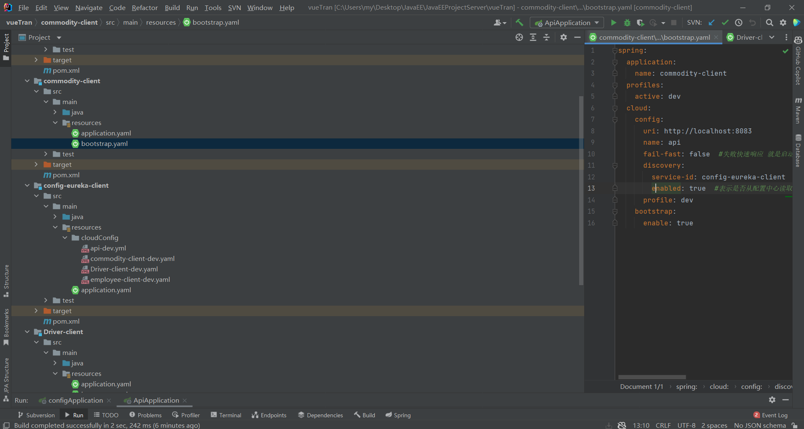
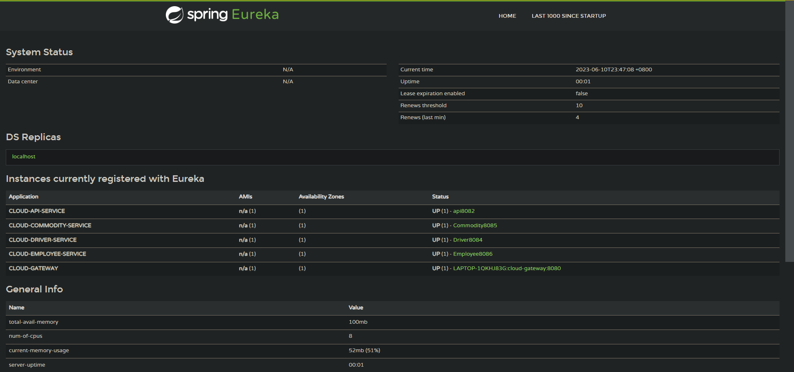

**Java EE 架构与应用 Assignment 3 物流管理系统  系统设计报告** 

项目地址链接：[divergent020620/JavaEEProjectServer at Assignment_3 (github.com)](https://github.com/divergent020620/JavaEEProjectServer/tree/Assignment_3)

| 成员 | 组长     | 组员1    | 组员2    |
| ---- | -------- | -------- | -------- |
| 学号 | 20301182 | 20301168 | 20301174 |
| 姓名 | 袁毅堂   | 饶睿     | 万兴全   |


# 要求

Assignment 3, A shipping and transportation services development with Micro-services Architecture and Spring-Cloud
	 In this assignment, you are asked to refactor the shipping and transportation management server-end using spring cloud.

**_Requirements:_**
1, Re-structuring your shipping and transportation services as **micro-services**.
2, Service discovery with **Eureka** is necessary.
3, **Circuit breaker implementation with Resilience4j** or Hystrix.
4, **Oauth2** authorization server integrated.
5, Expose API to external users with **Gateway**
6, Centralized configuration and tracking with **Spring cloud** config server and sleuth.


# 系统的重构与部署

## 微服务

将项目分解为四部分，分别为api，负责登录注册校验以及用户权限管理；commodity-client，负责商品管理；Driver-client，负责物流运输模块；employee-client，负责公司工作人员管理以及账目管理模块。

加入依赖：

```xml
        <dependency>
            <groupId>org.springframework.cloud</groupId>
            <artifactId>spring-cloud-starter-netflix-eureka-client</artifactId>
        </dependency>
        <dependency>
          <groupId>org.springframework.boot</groupId>
          <artifactId>spring-boot-starter-actuator</artifactId>
        </dependency>
```

配置Eureka客户端：

```yaml
eureka:
  client:
    register-with-eureka: true #表明将自己注册进EurekaServer
    fetch-registry: true
    service-url:
      defaultZone: http://localhost:8081/eureka/
  instance:
    instance-id: api8082 #注册的服务名称
```

springboot启动类配置Eureka：

```java
package com.example.api;

import org.springframework.boot.SpringApplication;
import org.springframework.boot.autoconfigure.SpringBootApplication;
import org.springframework.cloud.netflix.eureka.EnableEurekaClient;

@SpringBootApplication
@EnableEurekaClient

public class ApiApplication {
    public static void main(String[] args) {
        SpringApplication.run(ApiApplication.class, args);
    }

}
```


## 服务注册中心-Eureka

加入依赖：

```xml
        <dependency>
            <groupId>org.springframework.cloud</groupId>
            <artifactId>spring-cloud-starter-netflix-eureka-server</artifactId>
        </dependency>
        <dependency>
            <groupId>org.springframework.boot</groupId>
            <artifactId>spring-boot-starter-web</artifactId>
        </dependency>
        <dependency>
            <groupId>org.springframework.boot</groupId>
            <artifactId>spring-boot-starter-actuator</artifactId>
        </dependency>
```

Eureka注册中心配置：

```yaml
eureka:
  instance:
    hostname: eureka8081.com #Eureka服务器的实例名称
  client:
    register-with-eureka: false #不向注册中心注册自己
    fetch-registry: false #不需要去检索服务
    service-url:
      #设置与EurekaServer交互的地址查询服务和注册服务都需要依赖这个地址
      defaultZone: http://localhost:8081/eureka/
```

注册中心启动类：

```java
package com.example.api;

import org.springframework.boot.SpringApplication;
import org.springframework.boot.autoconfigure.SpringBootApplication;
import org.springframework.cloud.netflix.eureka.server.EnableEurekaServer;

@SpringBootApplication
@EnableEurekaServer

public class ApiApplication {

    public static void main(String[] args) {
        SpringApplication.run(ApiApplication.class, args);
    }

}

```


## 断路器的实现-Resilience4j

加入依赖：

```xml
        <dependency>
            <groupId>io.github.resilience4j</groupId>
            <artifactId>resilience4j-spring-boot2</artifactId>
            <version>1.7.0</version>
        </dependency>
        <dependency>
            <groupId>io.github.resilience4j</groupId>
            <artifactId>resilience4j-core</artifactId>
            <version>1.7.0</version>
        </dependency>

        <dependency>
            <groupId>io.github.resilience4j</groupId>
            <artifactId>resilience4j-timelimiter</artifactId>
            <version>1.7.0</version>
        </dependency>

        <dependency>
            <groupId>io.github.resilience4j</groupId>
            <artifactId>resilience4j-retry</artifactId>
            <version>1.7.0</version>
        </dependency>

        <dependency>
            <groupId>io.github.resilience4j</groupId>
            <artifactId>resilience4j-bulkhead</artifactId>
            <version>1.7.0</version>
        </dependency>

        <dependency>
            <groupId>io.github.resilience4j</groupId>
            <artifactId>resilience4j-ratelimiter</artifactId>
            <version>1.7.0</version>
        </dependency>

        <dependency>
            <groupId>io.github.resilience4j</groupId>
            <artifactId>resilience4j-circuitbreaker</artifactId>
            <version>1.7.0</version>
        </dependency>
```

在需要添加断路器的地方加上注释，并编写对应的备用fallback函数（举一例）

```java
    private static final String ADMIN_SERVICE = "adminService";

    @CircuitBreaker(name = ADMIN_SERVICE, fallbackMethod = "sendEmailFallback")
    @Override
    public Admin save(Admin admin) throws Exception {
        if (admin.getEmail().length() < 8 || admin.getPassword().length() < 5) {
            throw new Exception("请求参数异常");
        }
        admin.setCreateAt(DataTimeUtil.getNowTimeString());
        return adminRepository.save(admin);
    }

    public void sendEmailFallback(String email, Exception e) {
        // handle fallback behavior, for example:
        System.out.println("Fallback for sendEmail() method: " + e.getMessage());
    }
```

在application.yaml中编写resilience4j的断路器配置（举一例）

```yaml
resilience4j:
  circuitbreaker:
    configs:
      default:
        register-health-indicator: true # 是否注册断路器健康指标
        sliding-window-type: COUNT_BASED # 窗口类型，COUNT_BASED 或 TIME_BASED
        sliding-window-size: 10 # 窗口大小，根据配置的窗口类型不同，其含义也不同
        minimum-number-of-calls: 10 # 断路器的最小调用次数，在达到此次数之前，断路器始终关闭
        permitted-number-of-calls-in-half-open-state: 5 # 半开状态下允许的最大调用次数
        automatic-transition-from-open-to-half-open-enabled: true # 是否允许从打开状态自动转换到半开状态
        wait-duration-in-open-state: 30s # 断路器在打开状态下的等待时间，用于判断是否重新尝试调用原始方法
        failure-rate-threshold: 50 # 故障率阈值，达到该阈值时，断路器将打开
        slow-call-rate-threshold: 100 # 慢调用率阈值，达到该阈值时，断路器将打开
        slow-call-duration-threshold: 5s # 慢调用持续时间阈值，用于定义慢调用的时间
        writable-stack-trace-enabled: true # 是否启用断路器的可写堆栈跟踪
    instances:
      adminService:
        base-config: default # 选择默认配置
        register-health-indicator: true # 是否注册断路器健康指标
        event-consumer-buffer-size: 10 # 事件消费缓冲区大小
        ring-buffer-size-in-closed-state: 100 # 在关闭状态下使用的环形缓冲区大小
        ring-buffer-size-in-half-open-state: 10 # 在半开状态下使用的环形缓冲区大小
#        ring-buffer-size-in-open-state: 10 # 在打开状态下使用的环形缓冲区大小
      adminService2:
        base-config: default # 选择默认配置
        register-health-indicator: true # 是否注册断路器健康指标
        event-consumer-buffer-size: 10 # 事件消费缓冲区大小
        ring-buffer-size-in-closed-state: 100 # 在关闭状态下使用的环形缓冲区大小
        ring-buffer-size-in-half-open-state: 10 # 在半开状态下使用的环形缓冲区大小
#        ring-buffer-size-in-open-state: 10 # 在打开状态下使用的环形缓冲区大小
      adminService3:
        base-config: default # 选择默认配置
        register-health-indicator: true # 是否注册断路器健康指标
        event-consumer-buffer-size: 10 # 事件消费缓冲区大小
        ring-buffer-size-in-closed-state: 100 # 在关闭状态下使用的环形缓冲区大小
        ring-buffer-size-in-half-open-state: 10 # 在半开状态下使用的环形缓冲区大小
```

Resilience4j是一个轻量级的容错库，它提供了一组容错模式，如断路器、限流器、重试、缓存等，用于帮助开发人员构建可靠的、高可用的分布式系统。其中，断路器是Resilience4j中最常用的一种容错模式。

断路器模式是一种常用的容错模式，它可以在应用程序中实现自适应的故障处理。它通过监控外部服务的状态来决定是否打开断路器，当外部服务出现故障或者超时时，断路器会自动切换到开启状态，阻止请求转发到故障的服务上，从而减少了请求的响应时间和系统资源的消耗。当外部服务恢复正常时，断路器会自动切换到关闭状态，允许请求转发到服务上。

Resilience4j中的断路器模式包括以下几个组件：

1. CircuitBreaker（断路器）：用于对服务进行监控和控制，当服务出现故障或者超时时，自动打开断路器，阻止请求的转发，从而保护系统免受故障的影响。
2. CircuitBreakerRegistry（断路器注册中心）：用于管理和配置断路器实例，可以在应用程序中创建多个断路器实例，每个实例可以针对不同的服务进行监控和控制。
3. CircuitBreakerConfig（断路器配置）：用于配置断路器的参数，如故障率阈值、恢复时间、最大重试次数等。
4. CircuitBreakerEvent（断路器事件）：用于记录断路器的状态变化，如打开、关闭、半开等事件。

使用Resilience4j的断路器模式可以帮助开发人员构建可靠的、高可用的分布式系统，提高系统的容错能力和稳定性。


## Oauth2

加入依赖：

```xml
        <dependency>
            <groupId>org.springframework.security.oauth.boot</groupId>
            <artifactId>spring-security-oauth2-autoconfigure</artifactId>
            <version>2.2.6.RELEASE</version>
        </dependency>
```

编写配置类：

```java
package com.example.api.security;

import org.springframework.context.annotation.Bean;
import org.springframework.context.annotation.Configuration;
import org.springframework.security.authentication.AuthenticationManager;
import org.springframework.security.oauth2.config.annotation.configurers.ClientDetailsServiceConfigurer;
import org.springframework.security.oauth2.config.annotation.web.configuration.AuthorizationServerConfigurerAdapter;
import org.springframework.security.oauth2.config.annotation.web.configuration.EnableAuthorizationServer;
import org.springframework.security.oauth2.config.annotation.web.configurers.AuthorizationServerEndpointsConfigurer;
import org.springframework.security.oauth2.config.annotation.web.configurers.AuthorizationServerSecurityConfigurer;
import org.springframework.security.oauth2.provider.ClientDetailsService;
import org.springframework.security.oauth2.provider.client.JdbcClientDetailsService;
import org.springframework.security.oauth2.provider.token.TokenStore;
import org.springframework.security.oauth2.provider.token.store.InMemoryTokenStore;
import org.springframework.security.oauth2.provider.token.store.JdbcTokenStore;
import org.springframework.security.oauth2.provider.token.store.JwtAccessTokenConverter;
import org.springframework.security.oauth2.provider.token.store.JwtTokenStore;

import javax.annotation.Resource;
import javax.sql.DataSource;

@Configuration
@EnableAuthorizationServer
public class AuthorizationServerConfiguration extends AuthorizationServerConfigurerAdapter {

    @Resource
    private DataSource dataSource;

    @Resource
    private AuthenticationManager authenticationManager;

    @Resource
    private JwtTokenStore jwtTokenStore;

    @Resource
    private JwtAccessTokenConverter jwtAccessTokenConverter;


    @Bean
    public TokenStore tokenStore() {
//        //基于内存存储令牌
        return new InMemoryTokenStore();
        //基于jdbc存储token
        return new JdbcTokenStore(dataSource);
    }

    /**
     * 令牌端点，设置令牌
     *
     * @param endpoints
     * @throws Exception
     */
    @Override
    public void configure(AuthorizationServerEndpointsConfigurer endpoints) throws Exception {
        endpoints.tokenStore(tokenStore());
                .authenticationManager(authenticationManager);
                .tokenStore(jwtTokenStore)
                .accessTokenConverter(jwtAccessTokenConverter);
    }

    /**
     * 基于jdbc存储客户端信息，需要先进行配置
     *
     * @return
     */
    public ClientDetailsService clientDetailsService() {
        return new JdbcClientDetailsService(dataSource);
    }

    /**
     * 配置客户端信息
     *
     * @param clients
     * @throws Exception
     */
    @Override
    public void configure(ClientDetailsServiceConfigurer clients) throws Exception {
        clients.withClientDetails(clientDetailsService());
    }

    /**
     * 配置令牌端点的安全约束
     * @param security
     * @throws Exception
     */
    @Override
    public void configure(AuthorizationServerSecurityConfigurer security) throws Exception {
        security
                .tokenKeyAccess("permitAll()")//tokenKey这个endpoint完全公开
                .checkTokenAccess("permitAll()")//checkToken这个endpoint完全公开
                .allowFormAuthenticationForClients();//允许表单验证
    }
}

```

## Gateway

使用gateway注册在8080端口，监听8082,8084,8085,8086四个端口的微服务，使得前端能通过8080访问四个微服务端口。

注入依赖：

```xml
        <dependency>
            <groupId>org.springframework.cloud</groupId>
            <artifactId>spring-cloud-starter-gateway</artifactId>
        </dependency>
        <!--使用Eureka服务注册中心-->
        <dependency>
            <groupId>org.springframework.cloud</groupId>
            <artifactId>spring-cloud-starter-netflix-eureka-client</artifactId>
        </dependency>
```

编写配置类，允许端口跨域：

```java
package com.example.api.config;

import org.springframework.context.annotation.Bean;
import org.springframework.context.annotation.Configuration;
import org.springframework.web.cors.CorsConfiguration;
import org.springframework.web.cors.reactive.CorsWebFilter;
import org.springframework.web.cors.reactive.UrlBasedCorsConfigurationSource;
import org.springframework.web.server.WebFilter;
import org.springframework.web.util.pattern.PathPatternParser;

import java.util.Arrays;


/**
 * 跨域配置
 *
 * @author zc
 */
@Configuration
public class CorsConfig {

    @Bean
    public WebFilter corsFilter() {
        CorsConfiguration config = new CorsConfiguration();
        config.addAllowedMethod("*");
        config.addAllowedHeader("*");
        // 允许携带cookie的地址进行跨域
        config.setAllowCredentials(true);

        // 明确列出允许使用凭证的原始来源
        config.setAllowedOrigins(Arrays.asList("http://localhost:8083", "http://localhost:8082", "http://localhost:8084"
                , "http://localhost:8085", "http://localhost:8086"));
        // 或者使用allowedOriginPatterns
        // config.setAllowedOriginPatterns(Arrays.asList("http://example*.com"));

        UrlBasedCorsConfigurationSource source = new UrlBasedCorsConfigurationSource(new PathPatternParser());
        source.registerCorsConfiguration("/**", config);

        return new CorsWebFilter(source);
    }
}
```

配置路由：

```yaml
server:
  port: 8080
spring:
  mail:
    host: smtp.163.com
    protocol: smtp
    default-encoding: UTF-8
    #发件人
    username: gaoyuanming_1@163.com
    #授权码
    password: a123456
  datasource:
    driver-class-name: com.mysql.cj.jdbc.Driver
    url: jdbc:mysql://localhost:3306/bjpowernode?characterEncoding=utf8&serverTimezone=UTC
    username: root
    password: lion12345
  jpa:
    hibernate:
      ddl-auto: update
    open-in-view: false
  application:
    name: cloud-gateway
  cloud:
    #配置路由
    gateway:
      default-filters:
        - DedupeResponseHeader=Access-Control-Allow-Origin Access-Control-Allow-Credentials Vary, RETAIN_UNIQUE
      globalcors:
        add-to-simple-url-handler-mapping: true
        cors-configurations:
          '[/**]':
            allowedOrigins:
              - "http://localhost:8083"
              - "http://localhost:8082"
              - "http://localhost:8084"
              - "http://localhost:8085"
              - "http://localhost:8086"
            allowedMethods:
              - "GET"
              - "POST"
              - "DELETE"
              - "PUT"
              - "OPTIONS"
            allowedHeaders: "*"
            allowCredentials: true
            maxAge: 360000
      #这里可以配置多个路由
      routes:
        - id: payment_distribution #路由的id
          uri: http://localhost:8084 #匹配后提供服务的路由地址
          predicates:
            - Path=/api/distribution/**, /api/driver/**, /api/vehicle/**
        - id: payment_commodity #路由的id
          uri: http://localhost:8085 #匹配后提供服务的路由地址
          predicates:
            - Path=/api/commodity/**, /api/inventory/**
        - id: payment_employee #路由的id
          uri: http://localhost:8086 #匹配后提供服务的路由地址
          predicates:
            - Path=/api/employee/**, /api/sale/**, /api/warehouse/**
        - id: payment_routh #路由的id
          uri: http://localhost:8082 #匹配后提供服务的路由地址
          predicates:
            - Path=/** #断言 路径相匹配的进行路由


eureka:
  instance:
    hostname: cloud-gateway
  client:
    register-with-eureka: true #表明将自己注册进EurekaServer
    fetch-registry: true
    service-url:
      defaultZone: http://localhost:8081/eureka/
```

## SpringCloud Config

注入依赖：

```xml
    <dependency>
        <groupId>org.springframework.boot</groupId>
        <artifactId>spring-boot-starter-web</artifactId>
    </dependency>
    <dependency>
        <groupId>org.springframework.cloud</groupId>
        <artifactId>spring-cloud-config-server</artifactId>
    </dependency>
    <dependency>
        <groupId>org.springframework.cloud</groupId>
        <artifactId>spring-cloud-starter-netflix-eureka-client</artifactId>
    </dependency>
```

配置yml，使用本地作为配置注册中心：

```yml
server:
  port: 8083
spring:
  application:
    name: config-eureka-client
  http:
    converters:
      preferred-json-mapper: gson
  cloud:
    config:
      server:
        native:
          search-locations: classpath:/cloudConfig/
        bootstrap: true
  profiles:
    active: native
eureka:
  client:
    register-with-eureka: true #表明将自己注册进EurekaServer
    fetch-registry: true
    service-url:
      defaultZone: http://localhost:8081/eureka/
  instance:
    instance-id: configserver8083 #注册的服务名称
    preferIpAddress: true
```

在config client里编写配置：

```yml
spring:
  application:
    name: commodity-client
  profiles:
    active: dev
  cloud:
    config:
      uri: http://localhost:8083
      name: api
      fail-fast: false  #失败快速响应 就是启动的时候，如果启动失败能够快速响应，而不是日志都打印一大堆了，才报错
      discovery:
        service-id: config-eureka-client  #这里是config服务端注册到eureka的服务名称
        enabled: true  #表示是否从配置中心读取文件
      profile: dev
    bootstrap:
      enable: true
```

调整项目结构：



# 运行截图



# 其他内容

非本次作业内容见其他设计报告。
