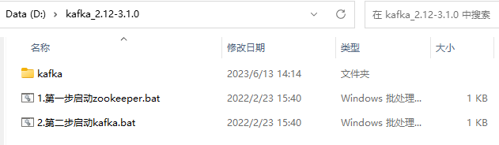
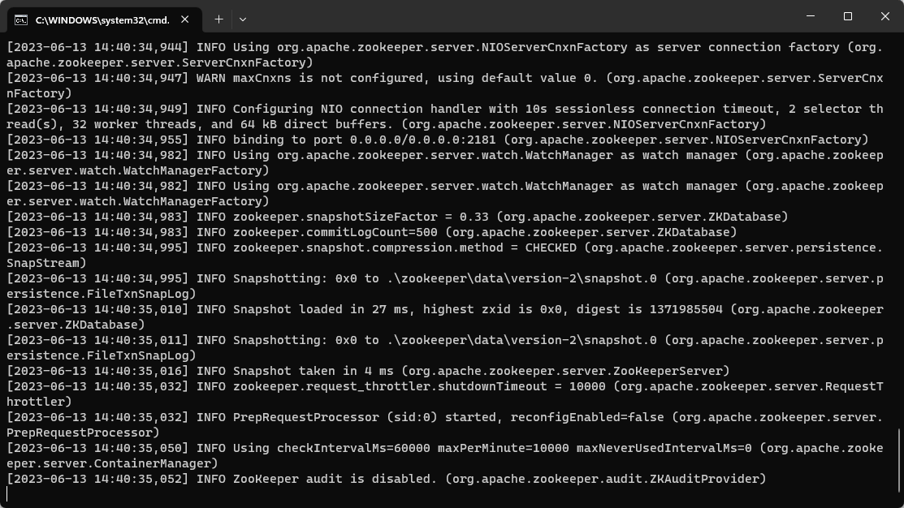
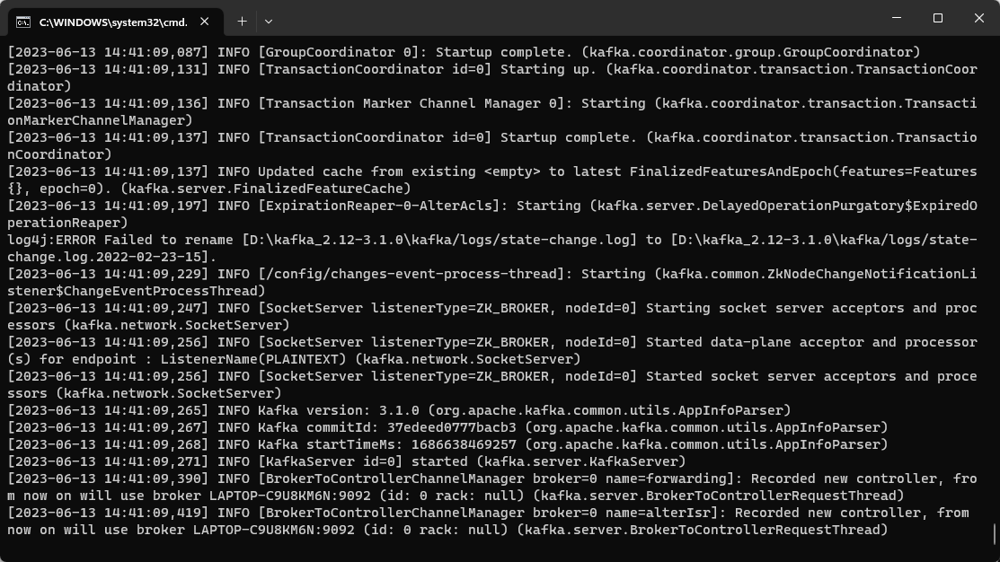
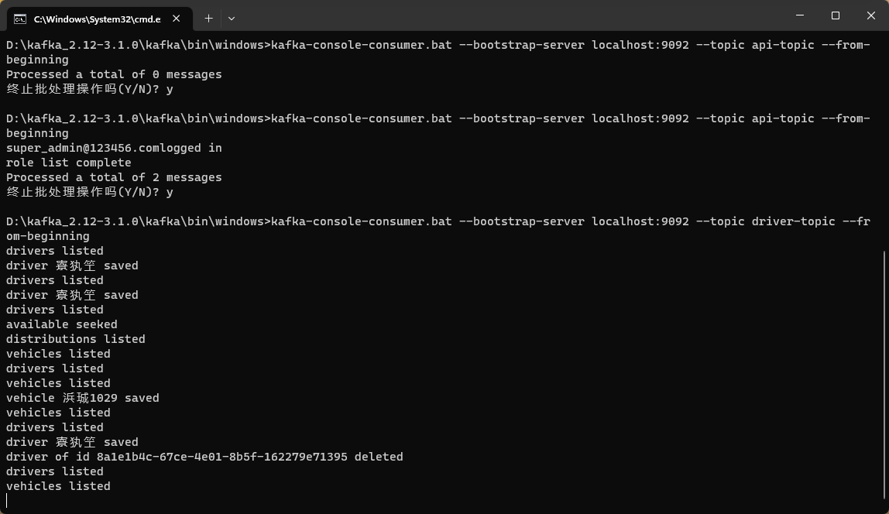
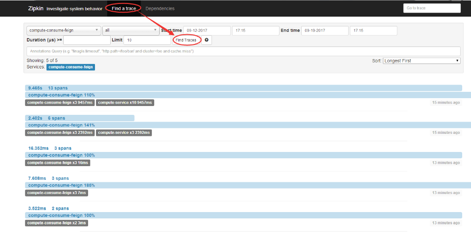

**Java EE 架构与应用 Assignment 4 物流管理系统  系统设计报告** 

项目地址链接：[divergent020620/JavaEEProjectServer at Assignment_4 (github.com)](https://github.com/divergent020620/JavaEEProjectServer/tree/Assignment_4)

| 成员 | 组长     | 组员1    | 组员2    |
| ---- | -------- | -------- | -------- |
| 学号 | 20301182 | 20301168 | 20301174 |
| 姓名 | 袁毅堂   | 饶睿     | 万兴全   |


# 要求

Assignment 4, Event-notification for microservices
	In this assignment, you are asked to further improve your assignment 3 project by adding the following features:
_1, Integration of microservices with **event-driven brokers**._
_2, Distributed configuration with **spring cloud config server**.(optional)_
_3, Distributed log tracing with spring cloud sleuth or **Zipkin** (optional)_

1, You need to rebuild or develop microservices which are integrated with (**kafka**) **message-queue**, tVo form an event-driven architecture.
2, Optional, integrating **spring cloud config** server for centralized configuration.
3, Optional, integrating Sleuth for centralized log tracing.‘


# Event Driven Brokers

它是一种基于事件驱动架构的消息代理或消息中间件，用于处理和分发事件。它允许系统中的各个组件通过发布和订阅事件的方式进行通信和交互。事件驱动的代理提供了解耦和灵活性，使得系统能够快速响应和处理事件。


# Kafka

一个分布式流处理平台和消息队列系统。Kafka旨在处理高容量、高吞吐量的实时数据流，并提供可持久化的、分布式的消息发布与订阅机制。以下是一些关键概念和特点：

1. 消息传递：Kafka基于发布-订阅模式，允许多个生产者将消息发布到一个或多个主题（topic），然后多个消费者可以订阅这些主题并接收消息。
2. 分布式架构：Kafka采用分布式架构，允许在多个服务器上进行扩展和容错。消息分区存储在不同的服务器上，以实现水平扩展和高可用性。
3. 高吞吐量：Kafka具有出色的吞吐量和低延迟，适用于处理大规模的实时数据流。
4. 持久化存储：Kafka使用持久化的消息存储，允许消息在被消费之后仍然保留在系统中，以供后续的消费者进行消费。
5. 消费者组：多个消费者可以组成一个消费者组，每个消费者组内的消费者可以共同消费一个主题的消息，实现负载均衡和故障转移。


## 配置

### Zookeeper配置

在..\kafka_2.12-3.1.0\kafka\config文件夹中，修改zookeepers.properties如下：

`clientPort=2181`

使得zookeeper在运行时端口2181上打开

Zookeeper是一个分布式协调服务，用于管理和协调分布式系统中的各个组件。它提供了分布式锁、命名服务、配置管理等功能，为分布式系统提供了一致性、可靠性和协调性。在Kafka中，Zookeeper用于管理和维护Kafka集群的元数据信息，包括主题（topic）、分区（partition）、消费者组（consumer group）等。

具体来说，Kafka使用Zookeeper来实现以下功能：

1. 配置管理：Kafka的服务器配置和集群配置信息存储在Zookeeper中。当Kafka服务器启动时，它会从Zookeeper获取必要的配置信息。
2. 元数据管理：Kafka的主题、分区和消费者组等元数据信息存储在Zookeeper中。生产者和消费者通过Zookeeper获取元数据信息，以了解消息的存储和消费情况。
3. 高可用性和故障转移：Kafka使用Zookeeper进行领导者选举。每个分区在集群中都有一个领导者（leader）和多个副本（replica），Zookeeper用于选举和维护分区的领导者，以实现高可用性和故障转移。

### Kafka配置

在..\kafka_2.12-3.1.0\kafka\config文件夹中，修改server.properties如下：

`zookeeper.connect=localhost:2181`

使得kafka服务器可以连接zookeeper

`log.dirs=./kafka-logs`

使得kafka可以记录日志，便于后续消息存储与分配

### 开启Kafka服务器

可通过命令行开启，这里使用实现配置好的.cmd文件开启：



开启后效果如下图所示：





### springboot项目连接Kafka服务器

加入依赖：

```xml
<dependency>
  <groupId>org.springframework.kafka</groupId>
  <artifactId>spring-kafka</artifactId>
</dependency>
```


在application.yaml中配置连接Kafka服务器，以api微服务为例：

```yaml
kafka:
  bootstrap-servers: localhost:9092
  #生产者
  producer:
    acks: 1
    retries: 3
    key-serializer: org.apache.kafka.common.serialization.StringSerializer
    value-serializer: org.apache.kafka.common.serialization.StringSerializer
  #消费者
  consumer:
    #默认消费组名
    group-id: api-consumer
    #关闭自动提交
    enable-auto-commit: false
    #提交间隔的毫秒 spring.kafka.consumer.auto-commit-interval.ms=60000
    # kafka消费指定每次最大消费消息数量
    max-poll-records: 1000
    #当各分区下有已提交的offset时，从提交的offset开始消费；无提交的offset时，从头开始消费
    #auto-offset-reset: earliest
    auto-offset-reset: latest
    key-deserializer: org.apache.kafka.common.serialization.StringDeserializer
    value-deserializer: org.apache.kafka.common.serialization.StringDeserializer
  listener:
    #手动提交
    ack-mode: manual_immediate
    # 设置批量消费
    type: batch
    # 并发数设置
    concurrency: 3
```

Kafka服务器在9092端口上打开

消费者名，每次最大消费量以及并发数等根据微服务组件各自情况进行调整


将所有后端接口进行注解，向相应的Kafka服务器中的话题中发送消息，以商品管理微服务组件中url为/api/commodity中的接口为例：

```java
package com.example.commodity.controller;

import com.example.commodity.model.entity.Commodity;
import com.example.commodity.service.CommodityService;
import org.springframework.beans.factory.annotation.Autowired;
import org.springframework.kafka.core.KafkaTemplate;
import org.springframework.security.access.prepost.PreAuthorize;
import org.springframework.web.bind.annotation.*;

import javax.annotation.Resource;
import java.util.List;

@RestController
@RequestMapping("/api/commodity")
@PreAuthorize("hasAnyRole('ROLE_SUPER_ADMIN' ,'ROLE_COMMODITY')")
public class CommodityController {

    @Autowired
    private KafkaTemplate<String, String> kafkaTemplate;

    @Resource
    private CommodityService commodityService;

    @PostMapping("")
    public Commodity save(@RequestBody Commodity commodity) {
        String topic = "commodity-topic";
        String normalMessage = "commodity of name " + commodity.getName() + " saved";
        kafkaTemplate.send(topic, normalMessage);
        return commodityService.save(commodity);
    }

    @DeleteMapping("")
    public void delete(String id) {
        String topic = "commodity-topic";
        String normalMessage = "commodity of id " + id + " deleted";
        kafkaTemplate.send(topic, normalMessage);
        commodityService.delete(id);
    }

    @PutMapping("")
    public void update(@RequestBody Commodity commodity) {
        String topic = "commodity-topic";
        String normalMessage = "commodity of id " + commodity.getId() + " updated";
        kafkaTemplate.send(topic, normalMessage);
        commodityService.update(commodity);
    }

    @GetMapping("")
    public List<Commodity> findAll() {
        String topic = "commodity-topic";
        String normalMessage = "commodities listed";
        kafkaTemplate.send(topic, normalMessage);
        return commodityService.findAll();
    }

    @GetMapping("/search/{name}")
    public List<Commodity> findByLikeName(@PathVariable String name) {
        String topic = "commodity-topic";
        String normalMessage = "commodity of name " + name + " found";
        kafkaTemplate.send(topic, normalMessage);
        return commodityService.findAllByLikeName(name);
    }

    @GetMapping("/{id}")
    public Commodity findById(@PathVariable String id) {
        String topic = "commodity-topic";
        String normalMessage = "commodity of id " + id + " found";
        kafkaTemplate.send(topic, normalMessage);
        return commodityService.findById(id);
    }
}
```


### 运行截图

完成所有方法配置后，前端在调用相应接口时即会向对应的Kafka话题中发送消息，可通过在..\kafka_2.12-3.1.0\kafka\bin\windows目录下运行命令：

​	`./kafka-console-consumer.bat --bootstrap-server localhost:9092 --topic <your-topic> --from-beginning`

将 your-topic 替换为想要查看的话题，来查看Kafka服务器中该话题下接收到的所有消息，以driver-topic话题中接收到的

消息为例：




# Zipkin

Zipkin是一个开源的分布式跟踪系统，用于帮助开发人员收集、查找和分析分布式系统中的请求追踪数据。

Zipkin的主要功能是跟踪请求在分布式系统中的流动，以及记录请求在不同组件之间的传递情况和延迟。它通过在系统的各个组件中插入特殊的跟踪代码，收集请求的跟踪信息并生成可视化的追踪图。这些追踪图展示了请求在系统中的路径、处理时间以及各个组件的性能指标，帮助开发人员快速定位和解决分布式系统中的性能问题。

以下是Zipkin的一些主要特点和组成部分：

1. 跟踪数据收集：Zipkin通过在系统中的不同组件中嵌入跟踪代码，收集请求的跟踪数据。跟踪数据包括请求的起始点、终止点、处理时间、各个组件之间的传递情况等。
2. 分布式追踪图：Zipkin将收集到的跟踪数据进行整理和可视化，生成分布式追踪图。追踪图展示了请求在系统中的路径和各个组件的性能指标，帮助开发人员分析和理解分布式系统的行为。
3. 跨服务追踪：Zipkin支持跨多个服务的追踪。当一个请求经过多个服务时，每个服务都会将跟踪数据传递给Zipkin服务器，最终形成完整的请求追踪路径。
4. 分布式上下文传播：Zipkin利用分布式上下文传播技术，将请求的上下文信息（如请求ID、跟踪ID等）在不同的服务之间传递，确保请求在分布式系统中的可追踪性。
5. 链路追踪分析：Zipkin提供了一些分析工具和报告，帮助开发人员理解系统的性能瓶颈和潜在问题。开发人员可以通过这些工具进行性能优化和故障排除。


## 配置

### Zipkin 服务端配置

引入依赖：

```xml
<dependency>
    <groupId>io.zipkin.java</groupId>
    <artifactId>zipkin-server</artifactId>
    <version>2.12.9</version>
</dependency>
<dependency>
    <groupId>org.springframework.cloud</groupId>
    <artifactId>spring-cloud-starter-zipkin</artifactId>
    <version>2.2.8.RELEASE</version>
</dependency>

<dependency>
    <groupId>org.springframework.boot</groupId>
    <artifactId>spring-boot-starter-web</artifactId>
</dependency>
<dependency>
    <groupId>org.springframework.boot</groupId>
    <artifactId>spring-boot-starter-actuator</artifactId>
</dependency>
<dependency>
    <groupId>com.alibaba</groupId>
    <artifactId>druid-spring-boot-starter</artifactId>
    <version>1.1.23</version>
</dependency>
<dependency>
    <groupId>org.projectlombok</groupId>
    <artifactId>lombok</artifactId>
</dependency>
<dependency>
    <groupId>org.springframework.boot</groupId>
    <artifactId>spring-boot-starter-test</artifactId>
    <scope>test</scope>
</dependency>
<dependency>
    <groupId>org.springframework.boot</groupId>
    <artifactId>spring-boot-autoconfigure</artifactId>
    <version>2.4.2</version>
</dependency>
```


在application.properties中配置端口：

```xml
spring.zipkin.base-url=http://localhost:9411
```


启动类，需要加入注解@EnableZipkinServer：

```java
package com.example.zipkinserver;

import org.springframework.boot.SpringApplication;
import org.springframework.boot.autoconfigure.SpringBootApplication;
import zipkin2.server.internal.EnableZipkinServer;

@EnableZipkinServer
@SpringBootApplication
public class ZipkinServerApplication {

    public static void main(String[] args) {
        SpringApplication.run(ZipkinServerApplication.class, args);
    }

}
```


同样可以使用官方提供的jar包


### Zipkin 客户端配置

引入依赖：

```xml
<dependency>
  <groupId>io.zipkin.brave</groupId>
  <artifactId>brave-core</artifactId>
  <version>3.9.0</version>
</dependency>
<dependency>
  <groupId>io.zipkin.brave</groupId>
  <artifactId>brave-spancollector-http</artifactId>
  <version>3.9.0</version>
</dependency>
<dependency>
  <groupId>io.zipkin.brave</groupId>
  <artifactId>brave-web-servlet-filter</artifactId>
  <version>3.9.0</version>
</dependency>
<dependency>
  <groupId>io.zipkin.brave</groupId>
  <artifactId>brave-okhttp</artifactId>
  <version>3.9.0</version>
</dependency>
<dependency>
  <groupId>org.springframework.cloud</groupId>
  <artifactId>spring-cloud-starter-sleuth</artifactId>
</dependency>

```


zipkin收集与配置类：

```java
public class ZipkinConfig {
    //span（一次请求信息或者一次链路调用）信息收集器
    @Bean
    public SpanCollector spanCollector() {
        Config config = HttpSpanCollector.Config.builder()
                .compressionEnabled(false)// 默认false，span在transport之前是否会被gzipped
                .connectTimeout(5000)
                .flushInterval(1)
                .readTimeout(6000)
                .build();
        return HttpSpanCollector.create("http://localhost:9411", config, new EmptySpanCollectorMetricsHandler());
    }

    //作为各调用链路，只需要负责将指定格式的数据发送给zipkin
    @Bean
    public Brave brave(SpanCollector spanCollector){
        Builder builder = new Builder("cloud-api-service");//指定serviceName
        builder.spanCollector(spanCollector);
        builder.traceSampler(Sampler.create(1));//采集率
        return builder.build();
    }


    //设置server的（服务端收到请求和服务端完成处理，并将结果发送给客户端）过滤器
    @Bean
    public BraveServletFilter braveServletFilter(Brave brave) {
        BraveServletFilter filter = new BraveServletFilter(brave.serverRequestInterceptor(),
                brave.serverResponseInterceptor(), new DefaultSpanNameProvider());
        return filter;
    }

    //设置client的（发起请求和获取到服务端返回信息）拦截器
    @Bean
    public OkHttpClient okHttpClient(Brave brave){
        OkHttpClient httpClient = new OkHttpClient.Builder()
                .addInterceptor(new BraveOkHttpRequestResponseInterceptor(
                        brave.clientRequestInterceptor(),
                        brave.clientResponseInterceptor(),
                        new DefaultSpanNameProvider())).build();
        return httpClient;
    }
}
```

在每个微服务组件中，需要将ZipKin配置类中的以下名称改为相应微服务的application.yaml中对应的applications.name名称，如：

 `Builder builder = new Builder("cloud-api-service");//指定serviceName`


业务代码，以展示权限列表为例：

```java
package com.example.api.controller;

import com.example.api.model.enums.Role;
import okhttp3.OkHttpClient;
import okhttp3.Request;
import okhttp3.Response;
import org.springframework.beans.factory.annotation.Autowired;
import org.springframework.kafka.core.KafkaTemplate;
import org.springframework.web.bind.annotation.GetMapping;
import org.springframework.web.bind.annotation.RequestMapping;
import org.springframework.web.bind.annotation.RestController;

@RestController
@RequestMapping("/api/role")
public class RoleController {

    @Autowired
    private KafkaTemplate<String, String> kafkaTemplate;

    @Autowired
    private OkHttpClient client;

    @GetMapping("")
    public Role[] list() throws Exception {
        String topic = "api-topic";
        String normalMessage = "role list complete";
        kafkaTemplate.send(topic, normalMessage);
        Request request = new Request.Builder().url("http://localhost:8082/cloud-api-service/api").build();
        Response response = client.newCall(request).execute();
        return Role.ROLES;
    }

}
```

此时即可向Zipkin服务器发送trace


### 运行截图


