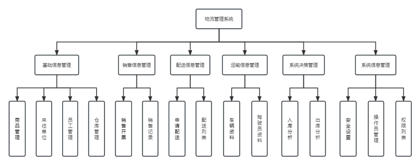
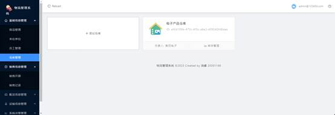
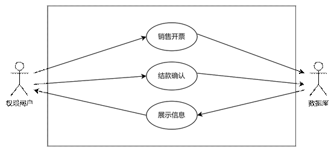
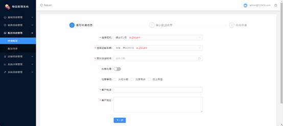
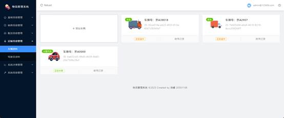
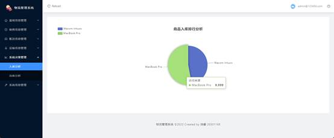
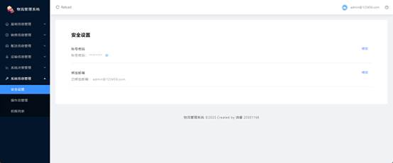

**Java EE 架构与应用 Assignment 2 物流管理系统  系统设计报告** 

项目地址链接：[divergent020620/JavaEEProjectServer at Assignment_2 (github.com)](https://github.com/divergent020620/JavaEEProjectServer/tree/Assignment_2)

| 成员 | 组长     | 组员1    | 组员2    |
| ---- | -------- | -------- | -------- |
| 学号 | 20301182 | 20301168 | 20301174 |
| 姓名 | 袁毅堂   | 饶睿     | 万兴全   |


# 要求

Assignment 2, Re-design of assignment1 with REST API and More
	 In this assignment, you are asked to re-develop the shipping and transportation management web application using REST api and Ajax. 

**_Requirements:_**
1, Design and implement the shipping and transportation services with **Restful API**.
2, **API Authentication** and **authorization using spring security** and **JWT** is necessary.
3, Continuous Unit testing for new added functions and components are required.
4, You are encouraged to apply **openapi document**, rate limiting and etc to improve your rest api.
5, Web-End may need redesign with ajax and **vue.js** replacing thymeleaf.


# 系统总体设计

本次项目为物流管理系统，主要分为6大模块15个工作包。系统设计图如下：



（1）基础信息管理模块

主要包括商品管理，设置商品的信息；来往单位，查看单位信息；员工管理，编辑修改员工信息；仓库管理，编辑修改仓库信息和管理人信息，包括商品的出库入库；

（2）销售信息管理

包括销售开票，在这里可以确认企业账款到账，编辑后自动同步到单位信息中；销售记录，查看企业的销售转账记录。

（3）配送信息管理

主要包括申请配送，须选择在系统内的商品和系统内车辆和驾驶员，同时可以选择配送时间和配送类型。在申请完后会出现在配送列表内，管理员之后可以进行审核通过来完成配送。

（4）运输信息管理

主要对车辆信息和驾驶员信息进行编辑增加和删除。

（5）系统决策管理

通过对仓库管理的信息来进行入库商品分析和出库商品分析。

（6）系统信息管理

系统管理员可以在此模块编辑各用户的管理权限，同时可以在此版块可以通过安全设置设置自己的邮箱和密码，同时查看自己的权限通过权限列表。

## 数据库设计

根据架构设计，我们设计生成了13张表，ER图如下：


**表说明**

| **序号** | **表名**         | **注释/说明** |
| -------- | ---------------- | ------------- |
| 1        | admin            | 管理员信息    |
| 2        | code             | 验证码        |
| 3        | commodity        | 货物信息      |
| 4        | company          | 公司信息      |
| 5        | distribution     | 配送信息      |
| 6        | driver           | 驾驶员信息    |
| 7        | employee         | 员工信息      |
| 8        | inventory        | 账单信息      |
| 9        | inventory_record | 账单记录信息  |
| 10       | sale             | 销售信息      |
| 11       | user             | 用户信息      |
| 12       | vehicle          | 车辆信息      |
| 13       | warehouse        | 仓库信息      |

**数据库表结构**

**1**、admin

| **序号** | **列名**                                                     | **数据类型** | **长度** | **小数位** | **主键** | **自增** | **允许空** | **默认值** | **列说明** |
| -------- | ------------------------------------------------------------ | ------------ | -------- | ---------- | -------- | -------- | ---------- | ---------- | ---------- |
| 1        | id                                                           | varchar      | 255      |            | √        |          |            |            |            |
| 2        | private static final String ADMIN_SERVICE = "adminService";​    @CircuitBreaker(name = ADMIN_SERVICE, fallbackMethod = "sendEmailFallback")    @Override    public Admin save(Admin admin) throws Exception {        if (admin.getEmail().length() < 8 \|\| admin.getPassword().length() < 5) {            throw new Exception("请求参数异常");        }        admin.setCreateAt(DataTimeUtil.getNowTimeString());        return adminRepository.save(admin);    }​    public void sendEmailFallback(String email, Exception e) {        // handle fallback behavior, for example:        System.out.println("Fallback for sendEmail() method: " + e.getMessage());    }java | varchar      | 255      |            |          |          | √          |            |            |
| 3        | email                                                        | varchar      | 255      |            |          |          | √          |            |            |
| 4        | password                                                     | varchar      | 255      |            |          |          | √          |            |            |
| 5        | roles                                                        | varchar      | 255      |            |          |          | √          |            |            |

**2**、code

| **序号** | **列名** | **数据类型** | **长度** | **小数位** | **主键** | **自增** | **允许空** | **默认值** | **列说明** |
| -------- | -------- | ------------ | -------- | ---------- | -------- | -------- | ---------- | ---------- | ---------- |
| 1        | email    | varchar      | 255      |            | √        |          |            |            |            |
| 2        | exp      | bigint       |          |            |          |          |            |            |            |
| 3        | value    | varchar      | 255      |            |          |          | √          |            |            |

**3**、commodity

| **序号** | **列名**    | **数据类型** | **长度** | **小数位** | **主键** | **自增** | **允许空** | **默认值** | **列说明** |
| -------- | ----------- | ------------ | -------- | ---------- | -------- | -------- | ---------- | ---------- | ---------- |
| 1        | id          | varchar      | 255      |            | √        |          |            |            |            |
| 2        | count       | int          |          |            |          |          |            |            |            |
| 3        | create_at   | varchar      | 255      |            |          |          | √          |            |            |
| 4        | description | varchar      | 255      |            |          |          | √          |            |            |
| 5        | name        | varchar      | 255      |            |          |          | √          |            |            |
| 6        | price       | double       | 22       |            |          |          |            |            |            |
| 7        | update_at   | varchar      | 255      |            |          |          | √          |            |            |

**4**、company

| **序号** | **列名** | **数据类型** | **长度** | **小数位** | **主键** | **自增** | **允许空** | **默认值** | **列说明** |
| -------- | -------- | ------------ | -------- | ---------- | -------- | -------- | ---------- | ---------- | ---------- |
| 1        | id       | varchar      | 255      |            | √        |          |            |            |            |

**5**、distribution

| **序号** | **列名** | **数据类型** | **长度** | **小数位** | **主键** | **自增** | **允许空** | **默认值** | **列说明** |
| -------- | -------- | ------------ | -------- | ---------- | -------- | -------- | ---------- | ---------- | ---------- |
| 1        | id       | varchar      | 255      |            | √        |          |            |            |            |
| 2        | address  | varchar      | 255      |            |          |          | √          |            |            |
| 3        | care     | varchar      | 255      |            |          |          | √          |            |            |
| 4        | did      | varchar      | 255      |            |          |          | √          |            |            |
| 5        | driver   | varchar      | 255      |            |          |          | √          |            |            |
| 6        | number   | varchar      | 255      |            |          |          | √          |            |            |
| 7        | phone    | varchar      | 255      |            |          |          | √          |            |            |
| 8        | status   | int          |          |            |          |          | √          |            |            |
| 9        | time     | varchar      | 255      |            |          |          | √          |            |            |
| 10       | urgent   | bit          |          |            |          |          |            |            |            |
| 11       | vid      | varchar      | 255      |            |          |          | √          |            |            |

**6**、driver

| **序号** | **列名**  | **数据类型** | **长度** | **小数位** | **主键** | **自增** | **允许空** | **默认值** | **列说明** |
| -------- | --------- | ------------ | -------- | ---------- | -------- | -------- | ---------- | ---------- | ---------- |
| 1        | id        | varchar      | 255      |            | √        |          |            |            |            |
| 2        | address   | varchar      | 255      |            |          |          | √          |            |            |
| 3        | create_at | varchar      | 255      |            |          |          | √          |            |            |
| 4        | driving   | bit          |          |            |          |          |            |            |            |
| 5        | gender    | varchar      | 255      |            |          |          | √          |            |            |
| 6        | id_card   | varchar      | 255      |            |          |          | √          |            |            |
| 7        | license   | varchar      | 255      |            |          |          | √          |            |            |
| 8        | name      | varchar      | 255      |            |          |          | √          |            |            |
| 9        | phone     | varchar      | 255      |            |          |          | √          |            |            |
| 10       | score     | varchar      | 255      |            |          |          | √          |            |            |
| 11       | update_at | varchar      | 255      |            |          |          | √          |            |            |

**7**、employee

| **序号** | **列名**   | **数据类型** | **长度** | **小数位** | **主键** | **自增** | **允许空** | **默认值** | **列说明** |
| -------- | ---------- | ------------ | -------- | ---------- | -------- | -------- | ---------- | ---------- | ---------- |
| 1        | id         | varchar      | 255      |            | √        |          |            |            |            |
| 2        | address    | varchar      | 255      |            |          |          | √          |            |            |
| 3        | create_at  | varchar      | 255      |            |          |          | √          |            |            |
| 4        | department | varchar      | 255      |            |          |          | √          |            |            |
| 5        | gender     | varchar      | 255      |            |          |          | √          |            |            |
| 6        | id_card    | varchar      | 255      |            |          |          | √          |            |            |
| 7        | name       | varchar      | 255      |            |          |          | √          |            |            |
| 8        | phone      | varchar      | 255      |            |          |          | √          |            |            |
| 9        | update_at  | varchar      | 255      |            |          |          | √          |            |            |

**8**、inventory

| **序号** | **列名** | **数据类型** | **长度** | **小数位** | **主键** | **自增** | **允许空** | **默认值** | **列说明** |
| -------- | -------- | ------------ | -------- | ---------- | -------- | -------- | ---------- | ---------- | ---------- |
| 1        | id       | varchar      | 255      |            | √        |          |            |            |            |
| 2        | cid      | varchar      | 255      |            |          |          | √          |            |            |
| 3        | count    | int          |          |            |          |          | √          |            |            |
| 4        | location | varchar      | 255      |            |          |          | √          |            |            |
| 5        | name     | varchar      | 255      |            |          |          | √          |            |            |
| 6        | wid      | varchar      | 255      |            |          |          | √          |            |            |

**9**、inventory_record

| **序号** | **列名**    | **数据类型** | **长度** | **小数位** | **主键** | **自增** | **允许空** | **默认值** | **列说明** |
| -------- | ----------- | ------------ | -------- | ---------- | -------- | -------- | ---------- | ---------- | ---------- |
| 1        | id          | varchar      | 255      |            | √        |          |            |            |            |
| 2        | cid         | varchar      | 255      |            |          |          | √          |            |            |
| 3        | count       | int          |          |            |          |          | √          |            |            |
| 4        | create_at   | varchar      | 255      |            |          |          | √          |            |            |
| 5        | description | varchar      | 255      |            |          |          | √          |            |            |
| 6        | name        | varchar      | 255      |            |          |          | √          |            |            |
| 7        | type        | int          |          |            |          |          | √          |            |            |
| 8        | wid         | varchar      | 255      |            |          |          | √          |            |            |

**10**、sale

| **序号** | **列名**    | **数据类型** | **长度** | **小数位** | **主键** | **自增** | **允许空** | **默认值** | **列说明** |
| -------- | ----------- | ------------ | -------- | ---------- | -------- | -------- | ---------- | ---------- | ---------- |
| 1        | id          | varchar      | 255      |            | √        |          |            |            |            |
| 2        | commodity   | varchar      | 255      |            |          |          | √          |            |            |
| 3        | company     | varchar      | 255      |            |          |          | √          |            |            |
| 4        | count       | varchar      | 255      |            |          |          | √          |            |            |
| 5        | create_at   | varchar      | 255      |            |          |          | √          |            |            |
| 6        | description | varchar      | 255      |            |          |          | √          |            |            |
| 7        | number      | varchar      | 255      |            |          |          | √          |            |            |
| 8        | pay         | bit          |          |            |          |          |            |            |            |
| 9        | phone       | varchar      | 255      |            |          |          | √          |            |            |
| 10       | price       | double       | 22       |            |          |          |            |            |            |

**11**、user

| **序号** | **列名**  | **数据类型** | **长度** | **小数位** | **主键** | **自增** | **允许空** | **默认值** | **列说明** |
| -------- | --------- | ------------ | -------- | ---------- | -------- | -------- | ---------- | ---------- | ---------- |
| 1        | id        | varchar      | 255      |            | √        |          |            |            |            |
| 2        | create_at | varchar      | 255      |            |          |          | √          |            |            |
| 3        | password  | varchar      | 255      |            |          |          | √          |            |            |
| 4        | update_at | varchar      | 255      |            |          |          | √          |            |            |
| 5        | username  | varchar      | 255      |            |          |          | √          |            |            |

**12**、vehicle

| **序号** | **列名**  | **数据类型** | **长度** | **小数位** | **主键** | **自增** | **允许空** | **默认值** | **列说明** |
| -------- | --------- | ------------ | -------- | ---------- | -------- | -------- | ---------- | ---------- | ---------- |
| 1        | id        | varchar      | 255      |            | √        |          |            |            |            |
| 2        | create_at | varchar      | 255      |            |          |          | √          |            |            |
| 3        | driving   | bit          |          |            |          |          |            |            |            |
| 4        | number    | varchar      | 255      |            |          |          | √          |            |            |
| 5        | type      | varchar      | 255      |            |          |          | √          |            |            |

**13**、warehouse 

| **序号** | **列名**  | **数据类型** | **长度** | **小数位** | **主键** | **自增** | **允许空** | **默认值** | **列说明** |
| -------- | --------- | ------------ | -------- | ---------- | -------- | -------- | ---------- | ---------- | ---------- |
| 1        | id        | varchar      | 255      |            | √        |          |            |            |            |
| 2        | create_at | varchar      | 255      |            |          |          | √          |            |            |
| 3        | name      | varchar      | 255      |            |          |          | √          |            |            |
| 4        | principle | varchar      | 255      |            |          |          | √          |            |            |

# 系统详细设计

模块设计

\1. 登陆模块

系统在初次启动时会显示为初始化系统，填入的邮箱密码为后续具有超级管理员权限的账号。以后登陆时变为正常的登陆界面。

由于系统封闭管理，注册统一由超级管理员或操作员管理员进行操作，仅提供登录功能。登陆可选邮箱密码登陆以及邮箱验证码登陆。用户可勾选自动登录以便下次登录时跳过这一模块业务。用户可点击忘记密码通过邮箱找回密码。

 

\2. 基础信息管理模块

用例图


 

组件设计

（1） 商品管理

此组件展示所有商品及其信息，分别为商品名称、库存数量、描述信息、入库时间与商品单价。用户可在顶部搜索列表中已有商品并展示以及用重置取消搜索展示的内容。权限用户可新增商品，输入商品名称、商品单价以及描述信息确定后会自动填充入库时间，库存数量默认为空，在另外组件中修改，此组件对库存仅做展示。


 

（2） 来往单位

此组件展示在销售开票组件中有来往的单位。展示内容为公司名称、预留电话以及首次创建时的时间。页面中可在顶部搜索来往公司并展示。


 

（3） 员工管理

此组件展示所有员工及其信息，分别为名字、性别、所在部门、联系电话、身份证以及家庭住址。权限用户可在顶部选择新增员工，对于身份证号与联系方式具有合法性验证，所在仓库为仓库管理组件中创建的仓库，性别为避免错误输入使用单选框选择。权限用户可编辑已有员工信息或删除已有员工信息。


 

（4） 仓库管理

此组件首先以卡片的形式展示所有仓库，权限用户可在首个卡片的位置可以选择添加仓库，添加时需输入仓库名称与仓库负责人，系统会给予ID作为唯一标识。代表每个仓库的卡片上可以选择库存管理进入仓库的次级页面。次级页面左上角可以选择返回上一页，其下展示仓库库存，展示项目为商品ID、商品名以及库存数量，此处各信息与商品管理组件中的信息相对应，商品管理组件中会集中展示所有仓库中各个商品的信息。权限用户可选择出入库商品，为避免输入错误选择商品使用下拉框的形式，商品数量具有合法性校验（单次不超过9999以及库存数量并且必须为正整数）。权限用户可通过按键下载excel格式的库存报表。权限用户可查看出入库记录，并可进一步选择下载excel格式的出入库记录。




 

\3. 销售信息管理模块

用例图



 

组件设计

（1） 销售开票

权限用户需按照填写信息、确认信息以及完成三个步骤完成本组件的业务，在顶部有当前处于何步骤的指示。填写信息中需分别输入公司名称、打款账号、售出商品、商品数量、预留电话以及备注信息，其中售出商品为避免输入错误使用下拉框选择，内容为商品管理组件中展示的商品。商品数量与预留电话具有相应合法性校验，除备注之外不能为空值。

确认信息中会展示上一步输入的信息，并且在右下角需展示商品的总价值，用户需要选择提交或返回上一部进行更改，提交按钮需要醒目，考虑使用红色按钮。确认后进入完成页面，提示提交完成并由用户选择重新提交新一份销售开票或是前往销售记录组件。


 

（2） 销售记录

此组件展示销售开票组件中完成业务的记录，展示内容分别为公司名称、打款账号、商品、数量、总计金额、预留电话、备注、开票时间以及更多操作。此页面对除更多操作以外的信息仅可作展示而不可修改。销售开票组件业务完成的一条记录的更多操作初始默认设置为等待结款，用户可点击结款并在弹出的确认窗口中确认后，方可置为借款完成。


 

\4. 配送信息管理模块

用例图


 

组件设计

（1） 申请配送

权限用户需按照填写申请信息、确认配送信息以及完成申请三个步骤完成本组件的业务，在顶部有当前处于何步骤的指示。填写配送信息中需分别输入选择司机、选择运输车辆、预计交货时间、是否加急处理、注意事项、客户电话以及客户地址。为避免输入出现错误，只有客户电话与客户地址由人工输入，客户电话具有合法性验证。司机、运输车辆以及交货时间由下拉框选择，前两者分别从运输信息管理的车辆资料组件以及驾驶员资料组件中的信息中选择，已经处于配送业务中的司机或车辆应有标识并且选中时不可前往下一步。加急处理设为开关样式按钮，注意事项由复选框选择是否冰柜冷藏、注意易碎以及防止高温。

确认信息中会展示上一步输入的信息，用户需要选择提交或返回上一部进行更改，提交按钮需要醒目，考虑使用红色按钮。确认后进入完成页面，提示提交完成并由用户选择重新提交新一份配送申请或是前往配送列表组件。



 

（2） 配送列表

此组件展示已完成申请业务的配送的记录，展示内容分别为司机、车牌号、客户电话、客户地址、注意事项、预计送达、当前状态以及操作。此页面对除操作以外的信息仅可作展示而不可修改。申请配送组件业务完成的一条记录的操作初始默认设置为等待审核。权限用户可点击编辑改变之前的信息，确认信息无误后可选择审核。审核中会弹出二次确认窗口，二次确认中的确认应足够醒目，使用红色按钮，确认后将当前状态修改为配送完成。


\5. 运输信息管理模块

用例图


 

组件设计

（1） 车辆资料

此组件以卡片的形式展示每一辆车的信息，包括车辆类型、车牌号、ID以及当前状态。权限用户可在第一张卡片的位置可选择添加车辆，需输入车牌号码以及车辆类型，系统会自动分配ID作为唯一标识。在每张卡片上可点击使用记录以查看每辆车的历史配送情况。



 

（2） 驾驶员资料

此组件展示驾驶员信息，包括名字、性别、联系电话、驾驶证号码、驾证分数、身份证以及家庭住址。权限用户可点击新增驾驶员来添加一条驾驶员信息，除性别为选择框以外其他均由用户自行输入，其中身份证号、联系方式以及驾照分数具有合法性校验。权限用户可对每一条信息选择编辑或删除。


 

\6. 系统决策管理模块

用例图


 

组件设计

（1） 入库分析

此组件以饼状图的形式展示所有商品入库数量，不同商品应有不同颜色，并在左上角给出颜色相对应的商品。鼠标悬浮在饼状图代表某商品的区域上时应显示具体的入库数量。



 

（2） 出库分析

此组件以饼状图的形式展示所有商品出库数量，不同商品应有不同颜色，并在左上角给出颜色相对应的商品。鼠标悬浮在饼状图代表某商品的区域上时应显示具体的出库数量。


 

\7. 系统信息管理模块

用例图


 

组件设计

（1） 安全设置

此组件展示当前账号的账号密码以及绑定邮箱，其中密码默认为安全状态显示为“********”，用户点击显示图标后方可进行显示。用户点击相应修改按钮后可对两项数据分别进行修改。



 

（2） 操作员管理

此组件可由权限用户查看与修改操作员。此页面展示操作员的邮箱、密码、权限以及添加日期。权限用户可通过按钮来添加操作员，需输入邮箱密码，均具有合法性校验，密码应由英文字母以及数字组成且大于六个字节，邮箱须符合邮箱格式，提交后系统会自动补全添加日期以及分配ID作为唯一标识。权限默认为空，可在每一条信息最后的action部分修改，权限分为操作员权限、商品全线、销售权限、仓库权限以及员工权限，此权限即各个模块所述需xxx相关权限才可查看与操作的权限，每一位操作员可具有一个或多个权限，系统初始化时的超级管理员具有所有权限。其他信息除ID与添加日期外同样均可在action部分修改。


 

（3） 权限列表

此组件为静态页面，展示五种可设置的权限，其中不包括系统初始化时的超级管理员权限。


 

# 系统的实现与部署（相比于第一次增加的内容）

## 前端

（1） Vue2


Vue2是一个流行的前端JavaScript框架，它采用了MVVM模式，是由Evan You于2014年在GitHub上创建的开源项目。Vue2具有以下特点：

数据驱动视图：Vue2通过使用响应式的数据绑定机制，将模型层的数据与视图层的HTML模板进行绑定，从而使得当数据发生变化时，对应的视图也会自动更新。

组件化开发：Vue2采用组件化的开发方式，将页面拆分成多个组件，每个组件可以独立维护自己的数据和方法，提高代码的复用性和可维护性。

轻量级：Vue2的体积非常小，仅有20KB左右，加载速度快。

丰富的API和插件：Vue2提供了丰富的API和插件，例如路由、状态管理、动画等，可以快速地构建复杂的单页应用。

易于学习和使用：Vue2的语法简单易懂，学习曲线较为平缓，上手容易，适合新手学习。同时，Vue2也提供了完整的文档和社区支持，解决了开发者在开发过程中遇到的问题。

Vue2是一个快速、高效、灵活、易用的前端框架，被广泛应用于构建单页应用和复杂的Web应用程序。

 

（2） Ant Design & Ant Design Vue

Ant Design是一个由阿里巴巴出品的企业级UI设计语言和React组件库，旨在帮助企业快速构建一致性和美观的Web应用程序。Ant Design基于最佳实践、经过大量的测试和丰富的实践经验，提供了一系列UI组件、图标和设计模式，帮助企业更快速、更高效地构建Web应用程序。

而Ant Design Vue是Ant Design在Vue框架下的组件库实现，提供了与Ant Design一样的丰富组件、设计模式、主题和工具，同时与Vue框架完美集成。Ant Design Vue的使用和Ant Design基本一致，也提供了详细的文档和示例代码。

Ant Design Vue具有以下特点：

符合Ant Design设计规范，UI风格简洁、美观、易于上手。

提供了众多的基础组件和高阶组件，包括按钮、表单、布局、导航、数据展示等等，涵盖了日常开发中大部分的组件需求。

支持自定义主题，提供了多种内置主题和样式变量，方便用户根据需求自定义主题样式。

提供了丰富的文档和示例，帮助用户快速上手和使用。

开发维护活跃，社区支持良好，定期更新和发布新版本。

Ant Design Vue是一款功能齐全、易于上手的Vue UI组件库，为开发人员提供了快速构建高质量前端界面的解决方案。

 

（3） Axios

axios 是一个基于 Promise 的 HTTP 客户端，可以在浏览器和 Node.js 环境中使用，用于发送 HTTP 请求并处理响应。它具有以下特点：

支持浏览器和 Node.js 平台

支持 Promise API

支持拦截请求和响应

支持取消请求

支持自动转换 JSON 数据

支持客户端防御 XSRF（跨站请求伪造）

在 Vue.js 项目中，可以通过安装 axios 模块来发送 HTTP 请求，与 Vue.js 无缝集成。由于 axios 支持 Promise API，因此可以使用 async/await 等异步操作方式，更加方便地处理异步操作。同时，axios 还可以自定义拦截器，在请求和响应中添加特定的处理逻辑。


## 后端

（1） Spring Security

```xml
    <!--SpringSecurity依赖-->
    <dependency>
      <groupId>org.springframework.boot</groupId>
      <artifactId>spring-boot-starter-security</artifactId>
    </dependency>
```

```java
package com.example.api.security;

import org.springframework.context.annotation.Bean;
import org.springframework.context.annotation.Configuration;
import org.springframework.security.config.annotation.method.configuration.EnableGlobalMethodSecurity;
import org.springframework.security.config.annotation.web.builders.HttpSecurity;
import org.springframework.security.config.annotation.web.configuration.WebSecurityConfigurerAdapter;
import org.springframework.security.config.http.SessionCreationPolicy;
import org.springframework.security.crypto.bcrypt.BCryptPasswordEncoder;
import org.springframework.web.cors.CorsConfiguration;
import org.springframework.web.cors.CorsConfigurationSource;
import org.springframework.web.cors.UrlBasedCorsConfigurationSource;

@Configuration
@EnableGlobalMethodSecurity(prePostEnabled = true)
public class SecurityConfiguration extends WebSecurityConfigurerAdapter {

    @Bean
    public BCryptPasswordEncoder bCryptPasswordEncoder() {
        return new BCryptPasswordEncoder();
    }

    /**
     * HTTP验证规则
     *
     * @param http h
     * @throws Exception e
     */
    @Override
    protected void configure(HttpSecurity http) throws Exception {

        //开启跨域
        http.csrf().disable().cors();

        //禁用session
        http.sessionManagement().sessionCreationPolicy(SessionCreationPolicy.STATELESS);
//        http.authorizeRequests()
//                .antMatchers("/login").permitAll()
//                .anyRequest().authenticated()
//                .and()
//                .addFilter(new JwtAuthorizationFilter(authenticationManagerBean()))
//                .csrf().disable();
        //添加自定义的jwt过滤器
        http.addFilter(new JwtAuthorizationFilter(authenticationManagerBean()));

    }

    /**
     * SpringSecurity有默认的跨域配置 会无法放行RequestHeader带有"Authorization"请求
     * 防止前端请求api报出cors error
     *
     * @return *
     */
    @Bean
    CorsConfigurationSource corsConfigurationSource() {
        final UrlBasedCorsConfigurationSource source = new UrlBasedCorsConfigurationSource();
        final CorsConfiguration corsConfiguration = new CorsConfiguration();
        corsConfiguration.addAllowedHeader("*");
        corsConfiguration.addAllowedHeader("DELETE");
        corsConfiguration.addAllowedMethod("*");
        corsConfiguration.addAllowedOrigin("*");
        source.registerCorsConfiguration("/**", corsConfiguration);
        return source;
    }

}

```

Spring Security是一个强大且可高度定制的身份验证和授权框架，它为基于Java的企业应用程序提供了身份验证和授权的支持。Spring Security的主要目的是保护应用程序不受攻击，通过认证和授权来控制访问。

Spring Security提供了一些重要的安全功能，如：

认证和授权：Spring Security提供了各种方式的身份验证和授权，包括基于表单的认证、基于HTTP基本认证和基于LDAP等。

会话管理：Spring Security提供了管理用户会话的功能，如在不活动状态下超时会话、自动登录等。

支持多种身份验证方式：Spring Security支持多种身份验证方式，如LDAP、基于记住我功能的身份验证等。

支持角色和权限：Spring Security支持通过角色和权限来限制用户的访问。

防止常见的安全攻击：Spring Security提供了防止一些常见的安全攻击的功能，如CSRF攻击、会话固定攻击、点击劫持攻击等。

Spring Security可以与Spring框架集成，并与Spring Boot轻松集成，使其易于使用和扩展。


（2）JWT

```xml
    <!--jwt依赖-->
    <dependency>
      <groupId>io.jsonwebtoken</groupId>
      <artifactId>jjwt</artifactId>
      <version>${jwt.version}</version>
    </dependency>
```

```java
package com.example.api.security;

import com.example.api.model.support.ResponseResult;
import com.example.api.utils.JwtTokenUtil;
import com.example.api.utils.ResponseUtil;
import org.springframework.security.authentication.AuthenticationManager;
import org.springframework.security.authentication.UsernamePasswordAuthenticationToken;
import org.springframework.security.core.authority.SimpleGrantedAuthority;
import org.springframework.security.core.context.SecurityContextHolder;
import org.springframework.security.web.authentication.www.BasicAuthenticationFilter;

import javax.servlet.FilterChain;
import javax.servlet.ServletException;
import javax.servlet.http.HttpServletRequest;
import javax.servlet.http.HttpServletResponse;
import java.io.IOException;
import java.util.ArrayList;
import java.util.List;

/**
 * 从Request的Authorization Header 获取Jwt
 * 解析Jwt授权发放token
 */
public class JwtAuthorizationFilter extends BasicAuthenticationFilter {

    public JwtAuthorizationFilter(AuthenticationManager authenticationManager) {
        super(authenticationManager);
    }

    @Override
    protected void doFilterInternal(HttpServletRequest request, HttpServletResponse response, FilterChain chain)
            throws IOException, ServletException {

        //从Request Header 取出Token
        String token = request.getHeader(JwtTokenUtil.TOKEN_HEADER);

        //Token为空放行
        //如果接下来进入的URL不是公共的地址SpringSecurity会返回403的错误
        if (!JwtTokenUtil.checkToken(token)){
            chain.doFilter(request, response);
            return;
        }

        //判断JWT Token是否过期
        if (JwtTokenUtil.isExpiration(token)) {
            ResponseUtil.writeJson(response, new ResponseResult<>(403, "令牌已过期, 请重新登录"));
            return;
        }

        //解析token
        String username = JwtTokenUtil.getUsername(token);
        List<String> tokenRoles = JwtTokenUtil.getTokenRoles(token);
        ArrayList<SimpleGrantedAuthority> roles = new ArrayList<>();
        for (String role : tokenRoles) {
            roles.add(new SimpleGrantedAuthority(role));
        }
        //向SpringSecurity的Context中加入认证信息
        SecurityContextHolder.getContext().setAuthentication(
                new UsernamePasswordAuthenticationToken(username,null, roles));
        System.out.println("doFilterInternal: "+roles.toString());
        super.doFilterInternal(request, response, chain);
    }

}

```

JWT（JSON Web Token）是一种用于在网络上安全传输信息的开放标准（RFC 7519），它采用JSON格式对数据进行加密和签名，以实现信息在网络上的安全传输。JWT通常用于身份认证和授权管理场景中，它可以帮助应用程序在不同的系统之间共享用户身份信息，并且可以防止中间人攻击和数据篡改等问题。

JWT由三部分组成：头部（Header）、载荷（Payload）和签名（Signature）。

- 头部：描述JWT的元数据，通常包括加密算法和类型等信息。
- 载荷：JWT的主体部分，包含了一些有关用户身份和其他信息的声明，如用户ID、角色、权限等。
- 签名：JWT的第三部分，用于验证JWT的完整性和真实性，通常使用加密算法和私钥生成。

JWT的工作流程如下：

1. 用户使用用户名和密码进行身份认证。
2. 服务器认证用户身份，并生成一个JWT。
3. 服务器将JWT作为响应返回给客户端。
4. 客户端将JWT保存在本地，并在每次请求中将JWT作为Authorization头部的Bearer Token发送给服务器。
5. 服务器验证JWT的合法性和完整性，并根据其中的声明信息进行授权管理。

使用JWT的好处包括：

1. 无状态：JWT中包含了所有必要的信息，因此不需要在服务器端存储用户的会话信息，从而实现无状态化。
2. 可扩展：JWT中可以自定义声明信息，因此可以根据需要扩展声明信息，满足不同场景下的需求。
3. 安全性高：JWT使用数字签名进行验证，可以防止中间人攻击和数据篡改等问题。
4. 跨平台：JWT采用JSON格式进行编码和解码，因此可以跨平台使用，适用于不同的编程语言和系统。

# RestAPI设计文档

```json
{
    "swagger": "2.0",
    "info": {
        "description": "物流管理项目SwaggerAPI管理",
        "version": "1.0",
        "title": "物流管理项目API"
    },
    "host": "localhost:8080",
    "basePath": "/",
    "tags": [
        {
            "name": "admin-controller",
            "description": "Admin Controller"
        },
        {
            "name": "commodity-controller",
            "description": "Commodity Controller"
        },
        {
            "name": "distribution-controller",
            "description": "Distribution Controller"
        },
        {
            "name": "driver-controller",
            "description": "Driver Controller"
        },
        {
            "name": "email-controller",
            "description": "Email Controller"
        },
        {
            "name": "employee-controller",
            "description": "Employee Controller"
        },
        {
            "name": "inventory-controller",
            "description": "Inventory Controller"
        },
        {
            "name": "role-controller",
            "description": "Role Controller"
        },
        {
            "name": "sale-controller",
            "description": "Sale Controller"
        },
        {
            "name": "vehicle-controller",
            "description": "Vehicle Controller"
        },
        {
            "name": "warehouse-controller",
            "description": "Warehouse Controller"
        }
    ],
    "paths": {
        "/api/admin": {
            "get": {
                "tags": [
                    "admin-controller"
                ],
                "summary": "findAll",
                "operationId": "findAllUsingGET",
                "produces": [
                    "*/*"
                ],
                "responses": {
                    "200": {
                        "description": "OK",
                        "schema": {
                            "type": "array",
                            "items": {
                                "$ref": "#/definitions/Admin"
                            }
                        }
                    },
                    "401": {
                        "description": "Unauthorized"
                    },
                    "403": {
                        "description": "Forbidden"
                    },
                    "404": {
                        "description": "Not Found"
                    }
                },
                "deprecated": false
            },
            "post": {
                "tags": [
                    "admin-controller"
                ],
                "summary": "save",
                "operationId": "saveUsingPOST",
                "consumes": [
                    "application/json"
                ],
                "produces": [
                    "*/*"
                ],
                "parameters": [
                    {
                        "in": "body",
                        "name": "admin",
                        "description": "admin",
                        "required": true,
                        "schema": {
                            "$ref": "#/definitions/Admin"
                        }
                    }
                ],
                "responses": {
                    "200": {
                        "description": "OK",
                        "schema": {
                            "$ref": "#/definitions/Admin"
                        }
                    },
                    "201": {
                        "description": "Created"
                    },
                    "401": {
                        "description": "Unauthorized"
                    },
                    "403": {
                        "description": "Forbidden"
                    },
                    "404": {
                        "description": "Not Found"
                    }
                },
                "deprecated": false
            },
            "delete": {
                "tags": [
                    "admin-controller"
                ],
                "summary": "delete",
                "operationId": "deleteUsingDELETE",
                "produces": [
                    "*/*"
                ],
                "parameters": [
                    {
                        "name": "id",
                        "in": "query",
                        "description": "id",
                        "required": false,
                        "type": "string"
                    }
                ],
                "responses": {
                    "200": {
                        "description": "OK"
                    },
                    "204": {
                        "description": "No Content"
                    },
                    "401": {
                        "description": "Unauthorized"
                    },
                    "403": {
                        "description": "Forbidden"
                    }
                },
                "deprecated": false
            }
        },
        "/api/admin/hasInit": {
            "get": {
                "tags": [
                    "admin-controller"
                ],
                "summary": "hasInit",
                "operationId": "hasInitUsingGET",
                "produces": [
                    "*/*"
                ],
                "responses": {
                    "200": {
                        "description": "OK",
                        "schema": {
                            "type": "boolean"
                        }
                    },
                    "401": {
                        "description": "Unauthorized"
                    },
                    "403": {
                        "description": "Forbidden"
                    },
                    "404": {
                        "description": "Not Found"
                    }
                },
                "deprecated": false
            }
        },
        "/api/admin/init": {
            "post": {
                "tags": [
                    "admin-controller"
                ],
                "summary": "init",
                "operationId": "initUsingPOST",
                "consumes": [
                    "application/json"
                ],
                "produces": [
                    "*/*"
                ],
                "parameters": [
                    {
                        "in": "body",
                        "name": "admin",
                        "description": "admin",
                        "required": true,
                        "schema": {
                            "$ref": "#/definitions/Admin"
                        }
                    }
                ],
                "responses": {
                    "200": {
                        "description": "OK",
                        "schema": {
                            "$ref": "#/definitions/Admin"
                        }
                    },
                    "201": {
                        "description": "Created"
                    },
                    "401": {
                        "description": "Unauthorized"
                    },
                    "403": {
                        "description": "Forbidden"
                    },
                    "404": {
                        "description": "Not Found"
                    }
                },
                "deprecated": false
            }
        },
        "/api/admin/login": {
            "post": {
                "tags": [
                    "admin-controller"
                ],
                "summary": "loginByEmail",
                "operationId": "loginByEmailUsingPOST",
                "consumes": [
                    "application/json"
                ],
                "produces": [
                    "*/*"
                ],
                "parameters": [
                    {
                        "in": "body",
                        "name": "dto",
                        "description": "dto",
                        "required": true,
                        "schema": {
                            "$ref": "#/definitions/LoginDto"
                        }
                    },
                    {
                        "name": "type",
                        "in": "query",
                        "description": "type",
                        "required": false,
                        "type": "string"
                    }
                ],
                "responses": {
                    "200": {
                        "description": "OK",
                        "schema": {
                            "type": "object"
                        }
                    },
                    "201": {
                        "description": "Created"
                    },
                    "401": {
                        "description": "Unauthorized"
                    },
                    "403": {
                        "description": "Forbidden"
                    },
                    "404": {
                        "description": "Not Found"
                    }
                },
                "deprecated": false
            }
        },
        "/api/admin/sendEmail": {
            "get": {
                "tags": [
                    "admin-controller"
                ],
                "summary": "sendEmail",
                "operationId": "sendEmailUsingGET",
                "produces": [
                    "*/*"
                ],
                "parameters": [
                    {
                        "name": "email",
                        "in": "query",
                        "description": "email",
                        "required": false,
                        "type": "string"
                    }
                ],
                "responses": {
                    "200": {
                        "description": "OK"
                    },
                    "401": {
                        "description": "Unauthorized"
                    },
                    "403": {
                        "description": "Forbidden"
                    },
                    "404": {
                        "description": "Not Found"
                    }
                },
                "deprecated": false
            }
        },
        "/api/commodity": {
            "get": {
                "tags": [
                    "commodity-controller"
                ],
                "summary": "findAll",
                "operationId": "findAllUsingGET_1",
                "produces": [
                    "*/*"
                ],
                "responses": {
                    "200": {
                        "description": "OK",
                        "schema": {
                            "type": "array",
                            "items": {
                                "$ref": "#/definitions/Commodity"
                            }
                        }
                    },
                    "401": {
                        "description": "Unauthorized"
                    },
                    "403": {
                        "description": "Forbidden"
                    },
                    "404": {
                        "description": "Not Found"
                    }
                },
                "deprecated": false
            },
            "post": {
                "tags": [
                    "commodity-controller"
                ],
                "summary": "save",
                "operationId": "saveUsingPOST_1",
                "consumes": [
                    "application/json"
                ],
                "produces": [
                    "*/*"
                ],
                "parameters": [
                    {
                        "in": "body",
                        "name": "commodity",
                        "description": "commodity",
                        "required": true,
                        "schema": {
                            "$ref": "#/definitions/Commodity"
                        }
                    }
                ],
                "responses": {
                    "200": {
                        "description": "OK",
                        "schema": {
                            "$ref": "#/definitions/Commodity"
                        }
                    },
                    "201": {
                        "description": "Created"
                    },
                    "401": {
                        "description": "Unauthorized"
                    },
                    "403": {
                        "description": "Forbidden"
                    },
                    "404": {
                        "description": "Not Found"
                    }
                },
                "deprecated": false
            },
            "put": {
                "tags": [
                    "commodity-controller"
                ],
                "summary": "update",
                "operationId": "updateUsingPUT",
                "consumes": [
                    "application/json"
                ],
                "produces": [
                    "*/*"
                ],
                "parameters": [
                    {
                        "in": "body",
                        "name": "commodity",
                        "description": "commodity",
                        "required": true,
                        "schema": {
                            "$ref": "#/definitions/Commodity"
                        }
                    }
                ],
                "responses": {
                    "200": {
                        "description": "OK"
                    },
                    "201": {
                        "description": "Created"
                    },
                    "401": {
                        "description": "Unauthorized"
                    },
                    "403": {
                        "description": "Forbidden"
                    },
                    "404": {
                        "description": "Not Found"
                    }
                },
                "deprecated": false
            },
            "delete": {
                "tags": [
                    "commodity-controller"
                ],
                "summary": "delete",
                "operationId": "deleteUsingDELETE_1",
                "produces": [
                    "*/*"
                ],
                "parameters": [
                    {
                        "name": "id",
                        "in": "query",
                        "description": "id",
                        "required": false,
                        "type": "string"
                    }
                ],
                "responses": {
                    "200": {
                        "description": "OK"
                    },
                    "204": {
                        "description": "No Content"
                    },
                    "401": {
                        "description": "Unauthorized"
                    },
                    "403": {
                        "description": "Forbidden"
                    }
                },
                "deprecated": false
            }
        },
        "/api/commodity/search/{name}": {
            "get": {
                "tags": [
                    "commodity-controller"
                ],
                "summary": "findByLikeName",
                "operationId": "findByLikeNameUsingGET",
                "produces": [
                    "*/*"
                ],
                "parameters": [
                    {
                        "name": "name",
                        "in": "path",
                        "description": "name",
                        "required": true,
                        "type": "string"
                    }
                ],
                "responses": {
                    "200": {
                        "description": "OK",
                        "schema": {
                            "type": "array",
                            "items": {
                                "$ref": "#/definitions/Commodity"
                            }
                        }
                    },
                    "401": {
                        "description": "Unauthorized"
                    },
                    "403": {
                        "description": "Forbidden"
                    },
                    "404": {
                        "description": "Not Found"
                    }
                },
                "deprecated": false
            }
        },
        "/api/commodity/{id}": {
            "get": {
                "tags": [
                    "commodity-controller"
                ],
                "summary": "findById",
                "operationId": "findByIdUsingGET",
                "produces": [
                    "*/*"
                ],
                "parameters": [
                    {
                        "name": "id",
                        "in": "path",
                        "description": "id",
                        "required": true,
                        "type": "string"
                    }
                ],
                "responses": {
                    "200": {
                        "description": "OK",
                        "schema": {
                            "$ref": "#/definitions/Commodity"
                        }
                    },
                    "401": {
                        "description": "Unauthorized"
                    },
                    "403": {
                        "description": "Forbidden"
                    },
                    "404": {
                        "description": "Not Found"
                    }
                },
                "deprecated": false
            }
        },
        "/api/distribution": {
            "get": {
                "tags": [
                    "distribution-controller"
                ],
                "summary": "findAll",
                "operationId": "findAllUsingGET_2",
                "produces": [
                    "*/*"
                ],
                "responses": {
                    "200": {
                        "description": "OK",
                        "schema": {
                            "type": "array",
                            "items": {
                                "$ref": "#/definitions/Distribution"
                            }
                        }
                    },
                    "401": {
                        "description": "Unauthorized"
                    },
                    "403": {
                        "description": "Forbidden"
                    },
                    "404": {
                        "description": "Not Found"
                    }
                },
                "deprecated": false
            },
            "post": {
                "tags": [
                    "distribution-controller"
                ],
                "summary": "save",
                "operationId": "saveUsingPOST_2",
                "consumes": [
                    "application/json"
                ],
                "produces": [
                    "*/*"
                ],
                "parameters": [
                    {
                        "in": "body",
                        "name": "distribution",
                        "description": "distribution",
                        "required": true,
                        "schema": {
                            "$ref": "#/definitions/Distribution"
                        }
                    }
                ],
                "responses": {
                    "200": {
                        "description": "OK",
                        "schema": {
                            "$ref": "#/definitions/Distribution"
                        }
                    },
                    "201": {
                        "description": "Created"
                    },
                    "401": {
                        "description": "Unauthorized"
                    },
                    "403": {
                        "description": "Forbidden"
                    },
                    "404": {
                        "description": "Not Found"
                    }
                },
                "deprecated": false
            }
        },
        "/api/distribution/can": {
            "get": {
                "tags": [
                    "distribution-controller"
                ],
                "summary": "can",
                "operationId": "canUsingGET",
                "produces": [
                    "*/*"
                ],
                "responses": {
                    "200": {
                        "description": "OK",
                        "schema": {
                            "type": "object"
                        }
                    },
                    "401": {
                        "description": "Unauthorized"
                    },
                    "403": {
                        "description": "Forbidden"
                    },
                    "404": {
                        "description": "Not Found"
                    }
                },
                "deprecated": false
            }
        },
        "/api/driver": {
            "get": {
                "tags": [
                    "driver-controller"
                ],
                "summary": "findAll",
                "operationId": "findAllUsingGET_3",
                "produces": [
                    "*/*"
                ],
                "responses": {
                    "200": {
                        "description": "OK",
                        "schema": {
                            "type": "array",
                            "items": {
                                "$ref": "#/definitions/Driver"
                            }
                        }
                    },
                    "401": {
                        "description": "Unauthorized"
                    },
                    "403": {
                        "description": "Forbidden"
                    },
                    "404": {
                        "description": "Not Found"
                    }
                },
                "deprecated": false
            },
            "post": {
                "tags": [
                    "driver-controller"
                ],
                "summary": "save",
                "operationId": "saveUsingPOST_3",
                "consumes": [
                    "application/json"
                ],
                "produces": [
                    "*/*"
                ],
                "parameters": [
                    {
                        "in": "body",
                        "name": "driver",
                        "description": "driver",
                        "required": true,
                        "schema": {
                            "$ref": "#/definitions/Driver"
                        }
                    }
                ],
                "responses": {
                    "200": {
                        "description": "OK",
                        "schema": {
                            "$ref": "#/definitions/Driver"
                        }
                    },
                    "201": {
                        "description": "Created"
                    },
                    "401": {
                        "description": "Unauthorized"
                    },
                    "403": {
                        "description": "Forbidden"
                    },
                    "404": {
                        "description": "Not Found"
                    }
                },
                "deprecated": false
            },
            "delete": {
                "tags": [
                    "driver-controller"
                ],
                "summary": "delete",
                "operationId": "deleteUsingDELETE_2",
                "produces": [
                    "*/*"
                ],
                "parameters": [
                    {
                        "name": "id",
                        "in": "query",
                        "description": "id",
                        "required": false,
                        "type": "string"
                    }
                ],
                "responses": {
                    "200": {
                        "description": "OK"
                    },
                    "204": {
                        "description": "No Content"
                    },
                    "401": {
                        "description": "Unauthorized"
                    },
                    "403": {
                        "description": "Forbidden"
                    }
                },
                "deprecated": false
            }
        },
        "/api/driver/{id}": {
            "get": {
                "tags": [
                    "driver-controller"
                ],
                "summary": "findById",
                "operationId": "findByIdUsingGET_1",
                "produces": [
                    "*/*"
                ],
                "parameters": [
                    {
                        "name": "id",
                        "in": "path",
                        "description": "id",
                        "required": true,
                        "type": "string"
                    }
                ],
                "responses": {
                    "200": {
                        "description": "OK",
                        "schema": {
                            "$ref": "#/definitions/Driver"
                        }
                    },
                    "401": {
                        "description": "Unauthorized"
                    },
                    "403": {
                        "description": "Forbidden"
                    },
                    "404": {
                        "description": "Not Found"
                    }
                },
                "deprecated": false
            }
        },
        "/api/email/send": {
            "get": {
                "tags": [
                    "email-controller"
                ],
                "summary": "send",
                "operationId": "sendUsingGET",
                "produces": [
                    "*/*"
                ],
                "responses": {
                    "200": {
                        "description": "OK",
                        "schema": {
                            "type": "string"
                        }
                    },
                    "401": {
                        "description": "Unauthorized"
                    },
                    "403": {
                        "description": "Forbidden"
                    },
                    "404": {
                        "description": "Not Found"
                    }
                },
                "deprecated": false
            }
        },
        "/api/employee": {
            "get": {
                "tags": [
                    "employee-controller"
                ],
                "summary": "findAll",
                "operationId": "findAllUsingGET_4",
                "produces": [
                    "*/*"
                ],
                "responses": {
                    "200": {
                        "description": "OK",
                        "schema": {
                            "type": "array",
                            "items": {
                                "$ref": "#/definitions/Employee"
                            }
                        }
                    },
                    "401": {
                        "description": "Unauthorized"
                    },
                    "403": {
                        "description": "Forbidden"
                    },
                    "404": {
                        "description": "Not Found"
                    }
                },
                "deprecated": false
            },
            "post": {
                "tags": [
                    "employee-controller"
                ],
                "summary": "save",
                "operationId": "saveUsingPOST_4",
                "consumes": [
                    "application/json"
                ],
                "produces": [
                    "*/*"
                ],
                "parameters": [
                    {
                        "in": "body",
                        "name": "employee",
                        "description": "employee",
                        "required": true,
                        "schema": {
                            "$ref": "#/definitions/Employee"
                        }
                    }
                ],
                "responses": {
                    "200": {
                        "description": "OK",
                        "schema": {
                            "$ref": "#/definitions/Employee"
                        }
                    },
                    "201": {
                        "description": "Created"
                    },
                    "401": {
                        "description": "Unauthorized"
                    },
                    "403": {
                        "description": "Forbidden"
                    },
                    "404": {
                        "description": "Not Found"
                    }
                },
                "deprecated": false
            },
            "put": {
                "tags": [
                    "employee-controller"
                ],
                "summary": "update",
                "operationId": "updateUsingPUT_1",
                "consumes": [
                    "application/json"
                ],
                "produces": [
                    "*/*"
                ],
                "parameters": [
                    {
                        "in": "body",
                        "name": "employee",
                        "description": "employee",
                        "required": true,
                        "schema": {
                            "$ref": "#/definitions/Employee"
                        }
                    }
                ],
                "responses": {
                    "200": {
                        "description": "OK"
                    },
                    "201": {
                        "description": "Created"
                    },
                    "401": {
                        "description": "Unauthorized"
                    },
                    "403": {
                        "description": "Forbidden"
                    },
                    "404": {
                        "description": "Not Found"
                    }
                },
                "deprecated": false
            },
            "delete": {
                "tags": [
                    "employee-controller"
                ],
                "summary": "delete",
                "operationId": "deleteUsingDELETE_3",
                "produces": [
                    "*/*"
                ],
                "parameters": [
                    {
                        "name": "id",
                        "in": "query",
                        "description": "id",
                        "required": false,
                        "type": "string"
                    }
                ],
                "responses": {
                    "200": {
                        "description": "OK"
                    },
                    "204": {
                        "description": "No Content"
                    },
                    "401": {
                        "description": "Unauthorized"
                    },
                    "403": {
                        "description": "Forbidden"
                    }
                },
                "deprecated": false
            }
        },
        "/api/employee/{id}": {
            "get": {
                "tags": [
                    "employee-controller"
                ],
                "summary": "findById",
                "operationId": "findByIdUsingGET_2",
                "produces": [
                    "*/*"
                ],
                "parameters": [
                    {
                        "name": "id",
                        "in": "path",
                        "description": "id",
                        "required": true,
                        "type": "string"
                    }
                ],
                "responses": {
                    "200": {
                        "description": "OK",
                        "schema": {
                            "$ref": "#/definitions/Employee"
                        }
                    },
                    "401": {
                        "description": "Unauthorized"
                    },
                    "403": {
                        "description": "Forbidden"
                    },
                    "404": {
                        "description": "Not Found"
                    }
                },
                "deprecated": false
            }
        },
        "/api/inventory": {
            "get": {
                "tags": [
                    "inventory-controller"
                ],
                "summary": "findAll",
                "operationId": "findAllUsingGET_5",
                "produces": [
                    "*/*"
                ],
                "responses": {
                    "200": {
                        "description": "OK",
                        "schema": {
                            "type": "array",
                            "items": {
                                "$ref": "#/definitions/Inventory"
                            }
                        }
                    },
                    "401": {
                        "description": "Unauthorized"
                    },
                    "403": {
                        "description": "Forbidden"
                    },
                    "404": {
                        "description": "Not Found"
                    }
                },
                "deprecated": false
            }
        },
        "/api/inventory/analyze": {
            "get": {
                "tags": [
                    "inventory-controller"
                ],
                "summary": "analyze",
                "operationId": "analyzeUsingGET",
                "produces": [
                    "*/*"
                ],
                "parameters": [
                    {
                        "name": "type",
                        "in": "query",
                        "description": "type",
                        "required": false,
                        "type": "integer",
                        "format": "int32"
                    }
                ],
                "responses": {
                    "200": {
                        "description": "OK",
                        "schema": {
                            "type": "array",
                            "items": {
                                "$ref": "#/definitions/CommodityChartVo"
                            }
                        }
                    },
                    "401": {
                        "description": "Unauthorized"
                    },
                    "403": {
                        "description": "Forbidden"
                    },
                    "404": {
                        "description": "Not Found"
                    }
                },
                "deprecated": false
            }
        },
        "/api/inventory/commodity/{id}": {
            "get": {
                "tags": [
                    "inventory-controller"
                ],
                "summary": "findByCommodity",
                "operationId": "findByCommodityUsingGET",
                "produces": [
                    "*/*"
                ],
                "parameters": [
                    {
                        "name": "id",
                        "in": "path",
                        "description": "id",
                        "required": true,
                        "type": "string"
                    }
                ],
                "responses": {
                    "200": {
                        "description": "OK",
                        "schema": {
                            "type": "array",
                            "items": {
                                "$ref": "#/definitions/Inventory"
                            }
                        }
                    },
                    "401": {
                        "description": "Unauthorized"
                    },
                    "403": {
                        "description": "Forbidden"
                    },
                    "404": {
                        "description": "Not Found"
                    }
                },
                "deprecated": false
            }
        },
        "/api/inventory/in": {
            "post": {
                "tags": [
                    "inventory-controller"
                ],
                "summary": "in",
                "operationId": "inUsingPOST",
                "consumes": [
                    "application/json"
                ],
                "produces": [
                    "*/*"
                ],
                "parameters": [
                    {
                        "in": "body",
                        "name": "record",
                        "description": "record",
                        "required": true,
                        "schema": {
                            "$ref": "#/definitions/InventoryRecord"
                        }
                    }
                ],
                "responses": {
                    "200": {
                        "description": "OK",
                        "schema": {
                            "$ref": "#/definitions/InventoryRecord"
                        }
                    },
                    "201": {
                        "description": "Created"
                    },
                    "401": {
                        "description": "Unauthorized"
                    },
                    "403": {
                        "description": "Forbidden"
                    },
                    "404": {
                        "description": "Not Found"
                    }
                },
                "deprecated": false
            }
        },
        "/api/inventory/out": {
            "post": {
                "tags": [
                    "inventory-controller"
                ],
                "summary": "out",
                "operationId": "outUsingPOST",
                "consumes": [
                    "application/json"
                ],
                "produces": [
                    "*/*"
                ],
                "parameters": [
                    {
                        "in": "body",
                        "name": "record",
                        "description": "record",
                        "required": true,
                        "schema": {
                            "$ref": "#/definitions/InventoryRecord"
                        }
                    }
                ],
                "responses": {
                    "200": {
                        "description": "OK",
                        "schema": {
                            "$ref": "#/definitions/InventoryRecord"
                        }
                    },
                    "201": {
                        "description": "Created"
                    },
                    "401": {
                        "description": "Unauthorized"
                    },
                    "403": {
                        "description": "Forbidden"
                    },
                    "404": {
                        "description": "Not Found"
                    }
                },
                "deprecated": false
            }
        },
        "/api/inventory/record/commodity/{id}": {
            "get": {
                "tags": [
                    "inventory-controller"
                ],
                "summary": "findRecordByCommodity",
                "operationId": "findRecordByCommodityUsingGET",
                "produces": [
                    "*/*"
                ],
                "parameters": [
                    {
                        "name": "id",
                        "in": "path",
                        "description": "id",
                        "required": true,
                        "type": "string"
                    }
                ],
                "responses": {
                    "200": {
                        "description": "OK",
                        "schema": {
                            "type": "array",
                            "items": {
                                "$ref": "#/definitions/InventoryRecord"
                            }
                        }
                    },
                    "401": {
                        "description": "Unauthorized"
                    },
                    "403": {
                        "description": "Forbidden"
                    },
                    "404": {
                        "description": "Not Found"
                    }
                },
                "deprecated": false
            }
        },
        "/api/inventory/record/warehouse/{id}": {
            "get": {
                "tags": [
                    "inventory-controller"
                ],
                "summary": "findRecordByWarehouse",
                "operationId": "findRecordByWarehouseUsingGET",
                "produces": [
                    "*/*"
                ],
                "parameters": [
                    {
                        "name": "id",
                        "in": "path",
                        "description": "id",
                        "required": true,
                        "type": "string"
                    }
                ],
                "responses": {
                    "200": {
                        "description": "OK",
                        "schema": {
                            "type": "array",
                            "items": {
                                "$ref": "#/definitions/InventoryRecord"
                            }
                        }
                    },
                    "401": {
                        "description": "Unauthorized"
                    },
                    "403": {
                        "description": "Forbidden"
                    },
                    "404": {
                        "description": "Not Found"
                    }
                },
                "deprecated": false
            }
        },
        "/api/inventory/warehouse/{id}": {
            "get": {
                "tags": [
                    "inventory-controller"
                ],
                "summary": "findByWarehouse",
                "operationId": "findByWarehouseUsingGET",
                "produces": [
                    "*/*"
                ],
                "parameters": [
                    {
                        "name": "id",
                        "in": "path",
                        "description": "id",
                        "required": true,
                        "type": "string"
                    }
                ],
                "responses": {
                    "200": {
                        "description": "OK",
                        "schema": {
                            "type": "array",
                            "items": {
                                "$ref": "#/definitions/Inventory"
                            }
                        }
                    },
                    "401": {
                        "description": "Unauthorized"
                    },
                    "403": {
                        "description": "Forbidden"
                    },
                    "404": {
                        "description": "Not Found"
                    }
                },
                "deprecated": false
            }
        },
        "/api/role": {
            "get": {
                "tags": [
                    "role-controller"
                ],
                "summary": "list",
                "operationId": "listUsingGET",
                "produces": [
                    "*/*"
                ],
                "responses": {
                    "200": {
                        "description": "OK",
                        "schema": {
                            "type": "array",
                            "items": {
                                "$ref": "#/definitions/Role"
                            }
                        }
                    },
                    "401": {
                        "description": "Unauthorized"
                    },
                    "403": {
                        "description": "Forbidden"
                    },
                    "404": {
                        "description": "Not Found"
                    }
                },
                "deprecated": false
            }
        },
        "/api/sale": {
            "get": {
                "tags": [
                    "sale-controller"
                ],
                "summary": "findAll",
                "operationId": "findAllUsingGET_6",
                "produces": [
                    "*/*"
                ],
                "responses": {
                    "200": {
                        "description": "OK",
                        "schema": {
                            "type": "array",
                            "items": {
                                "$ref": "#/definitions/Sale"
                            }
                        }
                    },
                    "401": {
                        "description": "Unauthorized"
                    },
                    "403": {
                        "description": "Forbidden"
                    },
                    "404": {
                        "description": "Not Found"
                    }
                },
                "deprecated": false
            },
            "post": {
                "tags": [
                    "sale-controller"
                ],
                "summary": "save",
                "operationId": "saveUsingPOST_5",
                "consumes": [
                    "application/json"
                ],
                "produces": [
                    "*/*"
                ],
                "parameters": [
                    {
                        "in": "body",
                        "name": "sale",
                        "description": "sale",
                        "required": true,
                        "schema": {
                            "$ref": "#/definitions/Sale"
                        }
                    }
                ],
                "responses": {
                    "200": {
                        "description": "OK",
                        "schema": {
                            "$ref": "#/definitions/Sale"
                        }
                    },
                    "201": {
                        "description": "Created"
                    },
                    "401": {
                        "description": "Unauthorized"
                    },
                    "403": {
                        "description": "Forbidden"
                    },
                    "404": {
                        "description": "Not Found"
                    }
                },
                "deprecated": false
            }
        },
        "/api/sale/search/{name}": {
            "get": {
                "tags": [
                    "sale-controller"
                ],
                "summary": "search",
                "operationId": "searchUsingGET",
                "produces": [
                    "*/*"
                ],
                "parameters": [
                    {
                        "name": "name",
                        "in": "path",
                        "description": "name",
                        "required": true,
                        "type": "string"
                    }
                ],
                "responses": {
                    "200": {
                        "description": "OK",
                        "schema": {
                            "type": "array",
                            "items": {
                                "$ref": "#/definitions/Sale"
                            }
                        }
                    },
                    "401": {
                        "description": "Unauthorized"
                    },
                    "403": {
                        "description": "Forbidden"
                    },
                    "404": {
                        "description": "Not Found"
                    }
                },
                "deprecated": false
            }
        },
        "/api/vehicle": {
            "get": {
                "tags": [
                    "vehicle-controller"
                ],
                "summary": "findAll",
                "operationId": "findAllUsingGET_7",
                "produces": [
                    "*/*"
                ],
                "responses": {
                    "200": {
                        "description": "OK",
                        "schema": {
                            "type": "array",
                            "items": {
                                "$ref": "#/definitions/Vehicle"
                            }
                        }
                    },
                    "401": {
                        "description": "Unauthorized"
                    },
                    "403": {
                        "description": "Forbidden"
                    },
                    "404": {
                        "description": "Not Found"
                    }
                },
                "deprecated": false
            },
            "post": {
                "tags": [
                    "vehicle-controller"
                ],
                "summary": "save",
                "operationId": "saveUsingPOST_6",
                "consumes": [
                    "application/json"
                ],
                "produces": [
                    "*/*"
                ],
                "parameters": [
                    {
                        "in": "body",
                        "name": "vehicle",
                        "description": "vehicle",
                        "required": true,
                        "schema": {
                            "$ref": "#/definitions/Vehicle"
                        }
                    }
                ],
                "responses": {
                    "200": {
                        "description": "OK",
                        "schema": {
                            "$ref": "#/definitions/Vehicle"
                        }
                    },
                    "201": {
                        "description": "Created"
                    },
                    "401": {
                        "description": "Unauthorized"
                    },
                    "403": {
                        "description": "Forbidden"
                    },
                    "404": {
                        "description": "Not Found"
                    }
                },
                "deprecated": false
            },
            "delete": {
                "tags": [
                    "vehicle-controller"
                ],
                "summary": "delete",
                "operationId": "deleteUsingDELETE_4",
                "produces": [
                    "*/*"
                ],
                "parameters": [
                    {
                        "name": "id",
                        "in": "query",
                        "description": "id",
                        "required": false,
                        "type": "string"
                    }
                ],
                "responses": {
                    "200": {
                        "description": "OK"
                    },
                    "204": {
                        "description": "No Content"
                    },
                    "401": {
                        "description": "Unauthorized"
                    },
                    "403": {
                        "description": "Forbidden"
                    }
                },
                "deprecated": false
            }
        },
        "/api/vehicle/{id}": {
            "get": {
                "tags": [
                    "vehicle-controller"
                ],
                "summary": "findById",
                "operationId": "findByIdUsingGET_3",
                "produces": [
                    "*/*"
                ],
                "parameters": [
                    {
                        "name": "id",
                        "in": "path",
                        "description": "id",
                        "required": true,
                        "type": "string"
                    }
                ],
                "responses": {
                    "200": {
                        "description": "OK",
                        "schema": {
                            "$ref": "#/definitions/Vehicle"
                        }
                    },
                    "401": {
                        "description": "Unauthorized"
                    },
                    "403": {
                        "description": "Forbidden"
                    },
                    "404": {
                        "description": "Not Found"
                    }
                },
                "deprecated": false
            }
        },
        "/api/warehouse": {
            "get": {
                "tags": [
                    "warehouse-controller"
                ],
                "summary": "findAll",
                "operationId": "findAllUsingGET_8",
                "produces": [
                    "*/*"
                ],
                "responses": {
                    "200": {
                        "description": "OK",
                        "schema": {
                            "type": "array",
                            "items": {
                                "$ref": "#/definitions/Warehouse"
                            }
                        }
                    },
                    "401": {
                        "description": "Unauthorized"
                    },
                    "403": {
                        "description": "Forbidden"
                    },
                    "404": {
                        "description": "Not Found"
                    }
                },
                "deprecated": false
            },
            "post": {
                "tags": [
                    "warehouse-controller"
                ],
                "summary": "save",
                "operationId": "saveUsingPOST_7",
                "consumes": [
                    "application/json"
                ],
                "produces": [
                    "*/*"
                ],
                "parameters": [
                    {
                        "in": "body",
                        "name": "warehouse",
                        "description": "warehouse",
                        "required": true,
                        "schema": {
                            "$ref": "#/definitions/Warehouse"
                        }
                    }
                ],
                "responses": {
                    "200": {
                        "description": "OK",
                        "schema": {
                            "$ref": "#/definitions/Warehouse"
                        }
                    },
                    "201": {
                        "description": "Created"
                    },
                    "401": {
                        "description": "Unauthorized"
                    },
                    "403": {
                        "description": "Forbidden"
                    },
                    "404": {
                        "description": "Not Found"
                    }
                },
                "deprecated": false
            },
            "delete": {
                "tags": [
                    "warehouse-controller"
                ],
                "summary": "delete",
                "operationId": "deleteUsingDELETE_5",
                "produces": [
                    "*/*"
                ],
                "parameters": [
                    {
                        "name": "id",
                        "in": "query",
                        "description": "id",
                        "required": false,
                        "type": "string"
                    }
                ],
                "responses": {
                    "200": {
                        "description": "OK"
                    },
                    "204": {
                        "description": "No Content"
                    },
                    "401": {
                        "description": "Unauthorized"
                    },
                    "403": {
                        "description": "Forbidden"
                    }
                },
                "deprecated": false
            }
        }
    },
    "definitions": {
        "Admin": {
            "type": "object",
            "properties": {
                "createAt": {
                    "type": "string"
                },
                "email": {
                    "type": "string"
                },
                "id": {
                    "type": "string"
                },
                "password": {
                    "type": "string"
                },
                "roles": {
                    "type": "string"
                }
            },
            "title": "Admin"
        },
        "Commodity": {
            "type": "object",
            "properties": {
                "count": {
                    "type": "integer",
                    "format": "int32"
                },
                "createAt": {
                    "type": "string"
                },
                "description": {
                    "type": "string"
                },
                "id": {
                    "type": "string"
                },
                "name": {
                    "type": "string"
                },
                "price": {
                    "type": "number",
                    "format": "double"
                },
                "updateAt": {
                    "type": "string"
                }
            },
            "title": "Commodity"
        },
        "CommodityChartVo": {
            "type": "object",
            "properties": {
                "name": {
                    "type": "string"
                },
                "value": {
                    "type": "integer",
                    "format": "int32"
                }
            },
            "title": "CommodityChartVo"
        },
        "Distribution": {
            "type": "object",
            "properties": {
                "address": {
                    "type": "string"
                },
                "care": {
                    "type": "string"
                },
                "did": {
                    "type": "string"
                },
                "driver": {
                    "type": "string"
                },
                "id": {
                    "type": "string"
                },
                "number": {
                    "type": "string"
                },
                "phone": {
                    "type": "string"
                },
                "status": {
                    "type": "integer",
                    "format": "int32"
                },
                "time": {
                    "type": "string"
                },
                "urgent": {
                    "type": "boolean"
                },
                "vid": {
                    "type": "string"
                }
            },
            "title": "Distribution"
        },
        "Driver": {
            "type": "object",
            "properties": {
                "address": {
                    "type": "string"
                },
                "createAt": {
                    "type": "string"
                },
                "driving": {
                    "type": "boolean"
                },
                "gender": {
                    "type": "string"
                },
                "id": {
                    "type": "string"
                },
                "idCard": {
                    "type": "string"
                },
                "license": {
                    "type": "string"
                },
                "name": {
                    "type": "string"
                },
                "phone": {
                    "type": "string"
                },
                "score": {
                    "type": "string"
                },
                "updateAt": {
                    "type": "string"
                }
            },
            "title": "Driver"
        },
        "Employee": {
            "type": "object",
            "properties": {
                "address": {
                    "type": "string"
                },
                "createAt": {
                    "type": "string"
                },
                "department": {
                    "type": "string"
                },
                "gender": {
                    "type": "string"
                },
                "id": {
                    "type": "string"
                },
                "idCard": {
                    "type": "string"
                },
                "name": {
                    "type": "string"
                },
                "phone": {
                    "type": "string"
                },
                "updateAt": {
                    "type": "string"
                }
            },
            "title": "Employee"
        },
        "Inventory": {
            "type": "object",
            "properties": {
                "cid": {
                    "type": "string"
                },
                "count": {
                    "type": "integer",
                    "format": "int32"
                },
                "id": {
                    "type": "string"
                },
                "location": {
                    "type": "string"
                },
                "name": {
                    "type": "string"
                },
                "wid": {
                    "type": "string"
                }
            },
            "title": "Inventory"
        },
        "InventoryRecord": {
            "type": "object",
            "properties": {
                "cid": {
                    "type": "string"
                },
                "count": {
                    "type": "integer",
                    "format": "int32"
                },
                "createAt": {
                    "type": "string"
                },
                "description": {
                    "type": "string"
                },
                "id": {
                    "type": "string"
                },
                "name": {
                    "type": "string"
                },
                "type": {
                    "type": "integer",
                    "format": "int32"
                },
                "wid": {
                    "type": "string"
                }
            },
            "title": "InventoryRecord"
        },
        "LoginDto": {
            "type": "object",
            "properties": {
                "code": {
                    "type": "string"
                },
                "email": {
                    "type": "string"
                },
                "password": {
                    "type": "string"
                },
                "remember": {
                    "type": "boolean"
                }
            },
            "title": "LoginDto"
        },
        "Role": {
            "type": "object",
            "properties": {
                "description": {
                    "type": "string"
                },
                "value": {
                    "type": "string"
                }
            },
            "title": "Role"
        },
        "Sale": {
            "type": "object",
            "properties": {
                "commodity": {
                    "type": "string"
                },
                "company": {
                    "type": "string"
                },
                "count": {
                    "type": "string"
                },
                "createAt": {
                    "type": "string"
                },
                "description": {
                    "type": "string"
                },
                "id": {
                    "type": "string"
                },
                "number": {
                    "type": "string"
                },
                "pay": {
                    "type": "boolean"
                },
                "phone": {
                    "type": "string"
                },
                "price": {
                    "type": "number",
                    "format": "double"
                }
            },
            "title": "Sale"
        },
        "Vehicle": {
            "type": "object",
            "properties": {
                "createAt": {
                    "type": "string"
                },
                "driving": {
                            
                    "type": "boolean"
                },
                "id": {
                    "type": "string"
                },
                "number": {
                    "type": "string"
                },
                "type": {
                    "type": "string"
                }
            },
            "title": "Vehicle"
        },
        "Warehouse": {
            "type": "object",
            "properties": {
                "createAt": {
                    "type": "string"
                },
                "id": {
                    "type": "string"
                },
                "name": {
                    "type": "string"
                },
                "principle": {
                    "type": "string"
                }
            },
            "title": "Warehouse"
        }
    }
}
```

# 其余内容与第一次报告相同

# 运行截图

见以上。

